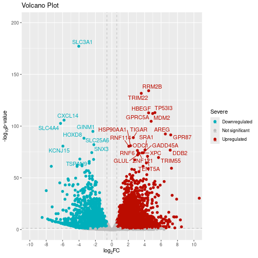

# AOPLink: Extracting and Analyzing Data Related to an AOP of Interest

*This workflow has originally been created in the OpenRiskNet. The original work can be seen [at this link](https://github.com/OpenRiskNet/notebooks/blob/master/AOPLink/Extracting%20and%20analysing%20data%20related%20to%20an%20AOP%20of%20interest.ipynb). Here, we present a reproduction of the workflow in the `R` language. However, please note that this is not an exact replication of the original workflow as some of the tools that are used in the original work are not available anymore, thus, removed or replaced in this reproduction. The R-Markdown file that includes the codes used in this tutorial can be found [here](https://github.com/VHP4Safety/vhp4safety-docs/blob/main/tutorials/aoplink/aoplink.r).*

_**Citation:** Marvin Martens, Thomas Exner, Tomaž Mohorič, Chris T Evelo, Egon L Willighagen. Workflow for extracting and analyzing data related to an AOP of interest. 2020_

One of the main questions to solve in AOPLink is the finding of data that supports an AOP of interest. To answer that, we have developed this workflow that does that by using a variety of online services:

- AOP-Wiki RDF
- CDK Depict
- AOP-DB RDF
- BridgeDb
- EdelweissData explorer (*not included*)
- WikiPathways (*to be added*)

After selecting an AOP of interest, information is extracted from the AOP-Wiki RDF, CDK Depict, and AOP-DB RDF, to get a better understanding of the AOP.

### Loading the Required Packages

A few packages needed to be loaded in order to complete the workflow.


``` r
library(SPARQL)
library(httr)
library(png)
library(magick)
library(flextable)
library(igraph)
# library(networkD3)  # To be used for an interactive AOP plot, if preferred
library(tidyverse)
library(RColorBrewer)
library(ggrepel)
```

Note that the SPARQL package is available on CRAN only in the archive. So, one needs to download the `.tar.gz` file from the archives (here version 1.16 is used) and install the package from the source file that can be found [here](https://cran.r-project.org/src/contrib/Archive/SPARQL/).


``` r
# Installing the SPARQL package from the source file. 
install.packages("path_to_the_file", repos=NULL, type="source")
```


## Defining the AOP of Interest

State the number of the AOP of interest as indicated on AOP-Wiki. Here we use AOP with the id number of [37](https://aopwiki.org/aops/37).


``` r
aop_id <- 37
```

### Setting the service URLs

Throughout the workflow, we are going to use several online services such as SPARQL endpoints. Here, these services are defined.


``` r
# SPARQL endpoint URLs
aopwikisparql       <- "https://aopwiki.cloud.vhp4safety.nl/sparql/"
aopdbsparql         <- "https://aopdb.rdf.bigcat-bioinformatics.org/sparql/"
wikipathwayssparql  <- "https://sparql.wikipathways.org/sparql/"

# ChemIdConvert and CDK Depict URLs
chemidconvert <- "https://chemidconvert.cloud.douglasconnect.com/v1/"
cdkdepict     <- "https://cdkdepict.cloud.vhp4safety.nl/"

# BridgeDB base URL
bridgedb <- "https://bridgedb.cloud.vhp4safety.nl/"
```

## AOP-Wiki RDF

#### Service Description

The AOP-Wiki repository is part of the AOP Knowledge Base (AOP-KB), a joint effort of the US-Environmental Protection Agency and European Commission - Joint Research Centre. It is developed to facilitate collaborative AOP development, storage of AOPs, and therefore allow reusing toxicological knowledge for risk assessors. This Case Study has converted the AOP-Wiki XML data into an RDF schema, which has been exposed in a public SPARQL endpoint as a service by VHP4Safety.

#### Implementation
First, general information of the AOP is fetched using a variety of SPARQL queries, using predicates from the [AOP-Wiki RDF schema](https://figshare.com/articles/poster/Enhancing_the_AOP-Wiki_usability_and_accessibility_with_semantic_web_technologies/11323685/1). This is used for:

* Creating an overview table of the AOP of interest
* Extending the AOP network with connected AOPs

Second, stressor chemicals are retrieved and stored for further analysis and fetching of data.

#### Creating the overview table


``` r
# Defining all variables as ontology terms present in AOP-Wiki RDF.
title                       <- "dc:title"
webpage                     <- "foaf:page"
creator                     <- "dc:creator"
abstract                    <- "dcterms:abstract"
key_event                   <- "aopo:has_key_event"
molecular_initiating_event  <- "aopo:has_molecular_initiating_event"
adverse_outcome             <- "aopo:has_adverse_outcome"
key_event_relationship      <- "aopo:has_key_event_relationship"
stressor                    <- "ncit:C54571"

# Creating the list of all terms of interest.
list_of_terms <- c(title, webpage, creator, abstract, key_event, 
                   molecular_initiating_event, adverse_outcome, key_event_relationship,
                   stressor)

# Creating a data frame to store the query results. 
aop_info <- data.frame("term"=list_of_terms, "properties"=NA)

# Making the queries for each terms in the selected AOP.
for (i in 1:length(list_of_terms)) {
  term  <- list_of_terms[i] 
  query <- paste0('PREFIX ncit: <http://ncicb.nci.nih.gov/xml/owl/EVS/Thesaurus.owl#>
                  SELECT (group_concat(distinct ?item;separator=";") as ?items)
                  WHERE{
                  ?AOP_URI a aopo:AdverseOutcomePathway;', term, ' ?item.
                  FILTER (?AOP_URI = aop:', aop_id, ')}'
)
  res                       <- SPARQL(aopwikisparql, query)
  aop_info[i, "properties"] <- res$results$items
}

flextable(aop_info)
```

<div class="tabwid"><style>.cl-ecfa1f76{}.cl-ecf41504{font-family:'DejaVu Sans';font-size:11pt;font-weight:normal;font-style:normal;text-decoration:none;color:rgba(0, 0, 0, 1.00);background-color:transparent;}.cl-ecf6dffa{margin:0;text-align:left;border-bottom: 0 solid rgba(0, 0, 0, 1.00);border-top: 0 solid rgba(0, 0, 0, 1.00);border-left: 0 solid rgba(0, 0, 0, 1.00);border-right: 0 solid rgba(0, 0, 0, 1.00);padding-bottom:5pt;padding-top:5pt;padding-left:5pt;padding-right:5pt;line-height: 1;background-color:transparent;}.cl-ecf6f1de{width:0.75in;background-color:transparent;vertical-align: middle;border-bottom: 1.5pt solid rgba(102, 102, 102, 1.00);border-top: 1.5pt solid rgba(102, 102, 102, 1.00);border-left: 0 solid rgba(0, 0, 0, 1.00);border-right: 0 solid rgba(0, 0, 0, 1.00);margin-bottom:0;margin-top:0;margin-left:0;margin-right:0;}.cl-ecf6f1e8{width:0.75in;background-color:transparent;vertical-align: middle;border-bottom: 0 solid rgba(0, 0, 0, 1.00);border-top: 0 solid rgba(0, 0, 0, 1.00);border-left: 0 solid rgba(0, 0, 0, 1.00);border-right: 0 solid rgba(0, 0, 0, 1.00);margin-bottom:0;margin-top:0;margin-left:0;margin-right:0;}.cl-ecf6f1f2{width:0.75in;background-color:transparent;vertical-align: middle;border-bottom: 1.5pt solid rgba(102, 102, 102, 1.00);border-top: 0 solid rgba(0, 0, 0, 1.00);border-left: 0 solid rgba(0, 0, 0, 1.00);border-right: 0 solid rgba(0, 0, 0, 1.00);margin-bottom:0;margin-top:0;margin-left:0;margin-right:0;}.tabwid {
  font-size: initial;
  padding-bottom: 1em;
}

.tabwid table{
  border-spacing:0px !important;
  border-collapse:collapse;
  line-height:1;
  margin-left:auto;
  margin-right:auto;
  border-width: 0;
  border-color: transparent;
  caption-side: top;
}
.tabwid-caption-bottom table{
  caption-side: bottom;
}
.tabwid_left table{
  margin-left:0;
}
.tabwid_right table{
  margin-right:0;
}
.tabwid td, .tabwid th {
    padding: 0;
}
.tabwid a {
  text-decoration: none;
}
.tabwid thead {
    background-color: transparent;
}
.tabwid tfoot {
    background-color: transparent;
}
.tabwid table tr {
background-color: transparent;
}
.katex-display {
    margin: 0 0 !important;
}</style><table data-quarto-disable-processing='true' class='cl-ecfa1f76'><thead><tr style="overflow-wrap:break-word;"><th class="cl-ecf6f1de"><p class="cl-ecf6dffa"><span class="cl-ecf41504">term</span></p></th><th class="cl-ecf6f1de"><p class="cl-ecf6dffa"><span class="cl-ecf41504">properties</span></p></th></tr></thead><tbody><tr style="overflow-wrap:break-word;"><td class="cl-ecf6f1e8"><p class="cl-ecf6dffa"><span class="cl-ecf41504">dc:title</span></p></td><td class="cl-ecf6f1e8"><p class="cl-ecf6dffa"><span class="cl-ecf41504">PPARα activation leading to hepatocellular adenomas and carcinomas in rodents</span></p></td></tr><tr style="overflow-wrap:break-word;"><td class="cl-ecf6f1e8"><p class="cl-ecf6dffa"><span class="cl-ecf41504">foaf:page</span></p></td><td class="cl-ecf6f1e8"><p class="cl-ecf6dffa"><span class="cl-ecf41504">https://identifiers.org/aop/37</span></p></td></tr><tr style="overflow-wrap:break-word;"><td class="cl-ecf6f1e8"><p class="cl-ecf6dffa"><span class="cl-ecf41504">dc:creator</span></p></td><td class="cl-ecf6f1e8"><p class="cl-ecf6dffa"><span class="cl-ecf41504">J. Christopher Corton, Cancer AOP Workgroup. National Health and Environmental Effects Research Laboratory, Office of Research and Development, Integrated Systems Toxicology Division, US Environmental Protection Agency, Research Triangle Park, NC. Corresponding author for wiki entry (corton.chris@epa.gov)</span><br></p></td></tr><tr style="overflow-wrap:break-word;"><td class="cl-ecf6f1e8"><p class="cl-ecf6dffa"><span class="cl-ecf41504">dcterms:abstract</span></p></td><td class="cl-ecf6f1e8"><p class="cl-ecf6dffa"><span class="cl-ecf41504">Several therapeutic agents and industrial chemicals induce liver tumors in rats and mice through the activation of the peroxisome proliferator-activated receptor alpha (PPAR&amp;alpha;). The molecular and cellular events by which PPAR&amp;alpha; activators induce rodent hepatocarcinogenesis have been extensively studied and elucidated. The weight of evidence relevant to the hypothesized AOP for PPAR&amp;alpha; activator-induced rodent hepatocarcinogenesis is summarized here. Chemical-specific and mechanistic data support concordance of temporal and dose&amp;ndash;response relationships for the key events associated with many PPAR&amp;alpha; activators including a phthalate ester plasticizer di(2-ethylhexyl)phthalate (DEHP) and the drug gemfibrozil. The key events (KE) identified include the MIE &amp;ndash; PPAR&amp;alpha; activation measured as a characteristic change in gene expression,&amp;nbsp;&amp;nbsp;KE2&amp;nbsp;&amp;ndash; increased enzyme activation, characteristically those involved in lipid metabolism and cell cycle control, KE3&amp;nbsp;&amp;ndash; increased cell proliferation, KE4 &amp;ndash; selective clonal expansion of preneoplastic foci, and the AO &amp;ndash; &amp;nbsp;&amp;ndash; increases in hepatocellular adenomas and carcinomas. &amp;nbsp;Other biological&amp;nbsp;factors modulate the effects of PPAR&amp;alpha; activators.These modulating events include increases in oxidative stress, activation of NF-kB, and inhibition of gap junction intercellular communication. The occurrence of hepatocellular adenomas and carcinomas is specific to mice and rats. The occurrence of the various KEs in&amp;nbsp;hamsters, guinea pigs,&amp;nbsp;cynomolgous monkeys are generally absent.</span><br></p></td></tr><tr style="overflow-wrap:break-word;"><td class="cl-ecf6f1e8"><p class="cl-ecf6dffa"><span class="cl-ecf41504">aopo:has_key_event</span></p></td><td class="cl-ecf6f1e8"><p class="cl-ecf6dffa"><span class="cl-ecf41504">https://identifiers.org/aop.events/1170;https://identifiers.org/aop.events/1171;https://identifiers.org/aop.events/227;https://identifiers.org/aop.events/716;https://identifiers.org/aop.events/719</span></p></td></tr><tr style="overflow-wrap:break-word;"><td class="cl-ecf6f1e8"><p class="cl-ecf6dffa"><span class="cl-ecf41504">aopo:has_molecular_initiating_event</span></p></td><td class="cl-ecf6f1e8"><p class="cl-ecf6dffa"><span class="cl-ecf41504">https://identifiers.org/aop.events/227</span></p></td></tr><tr style="overflow-wrap:break-word;"><td class="cl-ecf6f1e8"><p class="cl-ecf6dffa"><span class="cl-ecf41504">aopo:has_adverse_outcome</span></p></td><td class="cl-ecf6f1e8"><p class="cl-ecf6dffa"><span class="cl-ecf41504">https://identifiers.org/aop.events/719</span></p></td></tr><tr style="overflow-wrap:break-word;"><td class="cl-ecf6f1e8"><p class="cl-ecf6dffa"><span class="cl-ecf41504">aopo:has_key_event_relationship</span></p></td><td class="cl-ecf6f1e8"><p class="cl-ecf6dffa"><span class="cl-ecf41504">https://identifiers.org/aop.relationships/1229;https://identifiers.org/aop.relationships/1230;https://identifiers.org/aop.relationships/1232;https://identifiers.org/aop.relationships/1239;https://identifiers.org/aop.relationships/2252;https://identifiers.org/aop.relationships/2253;https://identifiers.org/aop.relationships/2254</span></p></td></tr><tr style="overflow-wrap:break-word;"><td class="cl-ecf6f1f2"><p class="cl-ecf6dffa"><span class="cl-ecf41504">ncit:C54571</span></p></td><td class="cl-ecf6f1f2"><p class="cl-ecf6dffa"><span class="cl-ecf41504">https://identifiers.org/aop.stressor/11;https://identifiers.org/aop.stressor/175;https://identifiers.org/aop.stressor/191;https://identifiers.org/aop.stressor/205;https://identifiers.org/aop.stressor/206;https://identifiers.org/aop.stressor/207;https://identifiers.org/aop.stressor/208;https://identifiers.org/aop.stressor/210;https://identifiers.org/aop.stressor/211</span></p></td></tr></tbody></table></div>

### Generating AOP Network


``` r
key_events <- aop_info[aop_info$term == "aopo:has_key_event", "properties"]
key_events <- unlist(strsplit(key_events, ";"))

mies      <- c()
kes       <- c()
aos       <- c()
kers      <- c()
ke_title  <- list()
# ke_rel    <- list()

for(i in 1:length(key_events)) {
  key_event <- key_events[i]
  
  query <- paste0('SELECT ?MIE_ID ?KE_ID ?AO_ID ?KER_ID ?KE_Title
    WHERE{
    ?KE_URI a aopo:KeyEvent; dcterms:isPartOf ?AOP_URI.
    ?AOP_URI aopo:has_key_event ?KE_URI2; aopo:has_molecular_initiating_event ?MIE_URI; aopo:has_adverse_outcome ?AO_URI; aopo:has_key_event_relationship ?KER_URI.
    ?KE_URI2 rdfs:label ?KE_ID; dc:title ?KE_Title. 
    ?MIE_URI rdfs:label ?MIE_ID.
    ?AO_URI rdfs:label ?AO_ID.
    ?KER_URI rdfs:label ?KER_ID.    
    FILTER (?KE_URI = <', key_event, '>)}
    ') 
  
  res <- SPARQL(aopwikisparql, query)
  res <- res$results
  
  mies  <- append(mies, unique(res$MIE_ID))
  kes   <- append(kes, unique(res$KE_ID))
  aos   <- append(aos, unique(res$AO_ID))
  kers  <- append(kers, unique(res$KER_ID))
  
  ke_title[[i]] <- tapply(res$KE_Title, res$KE_ID, function(x) x[1])
}

mies  <- unique(mies)
kes   <- unique(kes)
aos   <- unique(aos)
kers  <- unique(kers)

# ke_title <- unique(unlist(ke_title))
ke_title <- data.frame("key_event" = names(unlist(ke_title)), 
                  "title" = unlist(ke_title))
ke_title <- ke_title[!duplicated(ke_title), ]
ke_title
```

```
##    key_event                                                           title
## 1    KE 1170                            Increase, Phenotypic enzyme activity
## 2    KE 1171              Increase, Clonal Expansion of Altered Hepatic Foci
## 3     KE 227                                               Activation, PPARα
## 4     KE 716                      Increase, cell proliferation (hepatocytes)
## 5     KE 719                Increase, hepatocellular adenomas and carcinomas
## 14    KE 266         Decrease, Steroidogenic acute regulatory protein (STAR)
## 15    KE 289                           Decrease, Translocator protein (TSPO)
## 16    KE 348                           Malformation, Male reproductive tract
## 17    KE 406                                             impaired, Fertility
## 18    KE 413               Reduction, Testosterone synthesis in Leydig cells
## 19    KE 414                             Increase, Luteinizing hormone (LH) 
## 20    KE 415                                        Hyperplasia, Leydig cell
## 21    KE 416                            Increase proliferation, Leydig cell 
## 22    KE 446                                   Reduction, testosterone level
## 23    KE 447                Reduction, Cholesterol transport in mitochondria
## 24    KE 451             Inhibition, Mitochondrial fatty acid beta-oxidation
## 25    KE 458                                 Increased, De Novo FA synthesis
## 26    KE 459                                      Increased, Liver Steatosis
## 27    KE 478                                                Activation, NRF2
## 28    KE 479                                               Activation, NR1H4
## 29    KE 480                                                 Activation, SHP
## 30    KE 482                                         Decreased, DHB4/HSD17B4
## 31    KE 483                                           Activation, LXR alpha
## 34    KE 878                                             Inhibition, SREBP1c
## 35    KE 879                                                Activation, MTTP
## 36    KE 880                                              Increased, ApoB100
## 37    KE 881                                         Increased, Triglyceride
## 40   KE 1214 Altered gene expression specific to CAR activation, Hepatocytes
## 42    KE 715                    Activation, Constitutive androstane receptor
## 45    KE 774                      Increase, Preneoplastic foci (hepatocytes)
## 46    KE 785                                   Activation, Androgen receptor
## 50    KE 209                                               Peptide Oxidation
## 55    KE 724          Inhibition, Pyruvate dehydrogenase kinase (PDK) enzyme
## 56    KE 726            Increased, Induction of pyruvate dehydrogenase (PDH)
## 57    KE 768                                          Increase, Cytotoxicity
## 58    KE 769                                  Increase, Oxidative metabolism
## 61    KE 786                            Increase, Cytotoxicity (hepatocytes)
## 62    KE 787         Increase, Regenerative cell proliferation (hepatocytes)
```

``` r
# Listing all intermediate KEs that are not MIEs or AOs. 
kes_intermediate <- kes[!(kes %in% mies) & !(kes %in% aos)]
```


``` r
# Creating the AOP plot
pathway <- list()
for (i in 1:length(kers)) {
  ker   <- kers[i]
  query <- paste0('SELECT ?KE_UP_ID ?KE_DOWN_ID 
                WHERE{
                ?KER_URI a aopo:KeyEventRelationship; rdfs:label ?KER_ID; aopo:has_upstream_key_event ?KE_UP_URI; aopo:has_downstream_key_event ?KE_DOWN_URI.
                ?KE_UP_URI rdfs:label ?KE_UP_ID.
                ?KE_DOWN_URI rdfs:label ?KE_DOWN_ID.
                FILTER (?KER_ID = "', ker, '")}')
  # tmp <- SPARQL(aopwikisparql, query)
  # pathway[[i]] <- tmp$results
  pathway[[i]] <- SPARQL(aopwikisparql, query)$results
  names(pathway)[i] <- ker
}

pathway_plot <- make_graph(edges=unlist(pathway))

pathway_color <- rep(NA, length(names(V(pathway_plot))))
pathway_color[names(V(pathway_plot)) %in% mies]              <- "green"
pathway_color[names(V(pathway_plot)) %in% kes_intermediate]  <- "yellow"
pathway_color[names(V(pathway_plot)) %in% aos]               <- "red"
V(pathway_plot)$color <- pathway_color

par(mar = c(0, 0, 0, 0))
plot(pathway_plot)
```


``` r
# A very basic interactive graph can be created in RStudio with:
# networkD3::simpleNetwork(as.data.frame(matrix(unlist(pathway), byrow=TRUE,
#                         ncol=2)), opacity=1, linkColour="orange",
#                         nodeColour="green", fontSize=12)
```

### Query All Chemicals that are Part of the Selected AOP


``` r
query <- paste0('PREFIX ncit: <http://ncicb.nci.nih.gov/xml/owl/EVS/Thesaurus.owl#>
                SELECT ?CAS_ID (fn:substring(?CompTox,33) as ?CompTox_ID) ?Chemical_name
                WHERE{
                ?AOP_URI a aopo:AdverseOutcomePathway; ncit:C54571 ?Stressor.
                ?Stressor aopo:has_chemical_entity ?Chemical.
                ?Chemical cheminf:000446 ?CAS_ID; dc:title ?Chemical_name.
                OPTIONAL {?Chemical cheminf:000568 ?CompTox.}
                FILTER (?AOP_URI = aop:', aop_id, ')}
                ')

res <- SPARQL(aopwikisparql, query)
res <- res$results[, c("Chemical_name", "CAS_ID", "CompTox_ID")]

# List of compounds.
res
```

```
##                Chemical_name     CAS_ID    CompTox_ID
## 1 Di(2-ethylhexyl) phthalate   117-81-7 DTXSID5020607
## 2                Gemfibrozil 25812-30-0 DTXSID0020652
## 3                  Nafenopin  3771-19-5 DTXSID8020911
## 4                Bezafibrate 41859-67-0 DTXSID3029869
## 5                Fenofibrate 49562-28-9 DTXSID2029874
## 6             Pirinixic acid 50892-23-4 DTXSID4020290
## 7               Ciprofibrate 52214-84-3 DTXSID8020331
## 8                 Clofibrate   637-07-0 DTXSID3020336
```

``` r
# CAS-IDs of the compounds
res$CAS_ID
```

```
## [1] "117-81-7"   "25812-30-0" "3771-19-5"  "41859-67-0" "49562-28-9" "50892-23-4"
## [7] "52214-84-3" "637-07-0"
```


## ChemIdConvert and CDK Depict

### Service description

The ChemIdConverter allows users to submit and translate a variety of chemical descriptors, such as SMILES and InChI, through a REST API, whereas CDK Depcit is a webservice that converts a SMILES into 2D depictions (SVG or PNG).

### Implementation

Convert selected chemical names and display their chemical structures in a dataframe. It takes CAS IDs as an input, and translates them into Smiles and InChI Keys.


``` r
compoundstable <- data.frame(CAS_ID=res$CAS_ID, Smiles=NA, InChiKey=NA)

for(i in 1:nrow(compoundstable)) {
  compoundstable$Smiles[i]    <- content(GET(paste0(chemidconvert,
          "cas/to/smiles?cas=", compoundstable$CAS_ID[i])))$smiles
  compoundstable$InChiKey[i]  <- content(GET(paste0(chemidconvert,
          "cas/to/inchikey?cas=", compoundstable$CAS_ID[i])))$inchikey
}
compoundstable
```

```
##       CAS_ID                                         Smiles
## 1   117-81-7       CCCCC(CC)COC(=O)c1ccccc1C(=O)OCC(CC)CCCC
## 2 25812-30-0                Cc1ccc(C)c(OCCCC(C)(C)C(O)=O)c1
## 3  3771-19-5         CC(C)(Oc1ccc(cc1)C2CCCc3ccccc23)C(O)=O
## 4 41859-67-0   CC(C)(Oc1ccc(CCNC(=O)c2ccc(Cl)cc2)cc1)C(O)=O
## 5 49562-28-9 CC(C)OC(=O)C(C)(C)Oc1ccc(cc1)C(=O)c2ccc(Cl)cc2
## 6 50892-23-4            Cc1cccc(Nc2cc(Cl)nc(SCC(O)=O)n2)c1C
## 7 52214-84-3            CC(C)(Oc1ccc(cc1)C2CC2(Cl)Cl)C(O)=O
## 8   637-07-0                   CCOC(=O)C(C)(C)Oc1ccc(Cl)cc1
##                      InChiKey
## 1 BJQHLKABXJIVAM-UHFFFAOYSA-N
## 2 HEMJJKBWTPKOJG-UHFFFAOYSA-N
## 3 XJGBDJOMWKAZJS-UHFFFAOYSA-N
## 4 IIBYAHWJQTYFKB-UHFFFAOYSA-N
## 5 YMTINGFKWWXKFG-UHFFFAOYSA-N
## 6 SZRPDCCEHVWOJX-UHFFFAOYSA-N
## 7 KPSRODZRAIWAKH-UHFFFAOYSA-N
## 8 KNHUKKLJHYUCFP-UHFFFAOYSA-N
```


``` r
# Please note that this code chunk will download compound images to your 
# working directory. 
for(i in 1:nrow(compoundstable)) {
  tmp <- GET(paste0(cdkdepict, "depict/bot/png?smi=",
                    URLencode(compoundstable$Smiles[i]), "%20",
                    compoundstable$CAS_ID[i],
                    "&showtitle=true&abbr=on&zoom=1.5"))
  writePNG(content(tmp), target=paste0(compoundstable$CAS_ID[i], "_test.png"))
}

# par(mfrow=c(4, 2))
for(i in 1:nrow(compoundstable)){
  img <- image_read(paste0(compoundstable$CAS_ID[i], "_test.png"))
  plot(img)
}
```


## AOP-DB RDF

The EPA AOP-DB supports the discovery and development of putative and potential AOPs. Based on public annotations, it integrates AOPs with gene targets, chemicals, diseases, tissues, pathways, species orthology information, ontologies, and gene interactions. The AOP-DB facilitates the translation of AOP biological context, and associates assay, chemical and disease endpoints with AOPs ([Pittman et al., 2018](https://doi.org/10.1016/j.taap.2018.02.006); [Mortensen et al., 2018](https://doi.org/10.1007/s00335-018-9738-7)). The AOP-DB won the first OpenRiskNet implementation challenge of the associated partner program and is therefore integrated into the OpenRiskNet e-infrastructure. After the conversion of the AOP-DB into an RDF schema, its data will be exposed in a Virtuoso SPARQL endpoint.

#### Implementation

Extracting all genes related to AOP of interest. 


``` r
# Creating a list to store the results.
genes_entrez <- list()

# Making SPARQL queries for all key events. 
for(i in 1:length(key_events)) {
  key_event <- key_events[i]

  # Getting only the key event's id.
  key_event <- strsplit(key_event, "/")[[1]][5]
  
  query <- paste0('PREFIX aop.events: <http://identifiers.org/aop.events/>
    SELECT DISTINCT ?KE_URI ?Entrez_ID
    WHERE{
      ?KE_URI edam:data_1027 ?Entrez_URI.
      ?Entrez_URI edam:data_1027 ?Entrez_ID.
      FILTER (?KE_URI = aop.events:', key_event,')}
  ')
  
  res                     <- SPARQL(aopdbsparql, query)
  genes_entrez[[i]]       <- res$results
  names(genes_entrez)[i]  <- key_event
}

# Converting the results into a data frame. 
for(i in 1:length(genes_entrez)) {
  if(nrow(genes_entrez[[i]]) > 0) {
    genes_entrez[[i]][, 1] <- names(genes_entrez)[i]
  }
}
genes_entrez            <- matrix(unlist(genes_entrez), ncol=2, byrow=FALSE)
colnames(genes_entrez)  <- c("KE", "Entrez")  
genes_entrez            <- as.data.frame(genes_entrez)
genes_entrez
```

```
##    KE Entrez
## 1 227   5465
## 2 227 403654
## 3 227  19013
## 4 227  25747
```

``` r
genes <- genes_entrez$Entrez
genes
```

```
## [1] "5465"   "403654" "19013"  "25747"
```


### BridgeDb to Map Identifiers

#### Service Description
BridgeDb to map identifiers
Service description
In order to link databases and services that use particular identifiers for genes, proteins, and chemicals, the BridgeDb platform is integrated into the OpenRiskNet e-infrastructure. It allows for identifier mapping between various biological databases for data integration and interoperability ([van Iersel et al., 2010](https://doi.org/10.1186/1471-2105-11-5)).

#### Implementation

The genes from AOP-DB are mapped to identifiers from other databases using BridgeDb. Variable values are filled for `input_data_source` and `output_data_source` identifiers based on BridgeDb's [documentation on system codes](https://www.bridgedb.org/pages/system-codes.html). Also, the species is specified as a value in the variable `species`.


``` r
input_data_source   <- "L"
output_data_source  <- c("H", "En")
species             <- c("Human", "Dog", "Mouse", "Rat")

mappings  <- data.frame()

for(i in 1:length(output_data_source)) {
  source <- output_data_source[i]
  for(entrez in genes) {
    for(spec in species) {
      query_url <- paste0(bridgedb, spec, "/xrefs/", input_data_source, "/", 
                          entrez, "?dataSource=", source)
      res <- GET(query_url)
      dat <- content(res, as="text")
      
      if(dat != "{}") {
        dat <- as.data.frame(strsplit(dat, ",")[[1]])
        dat <- unlist(apply(dat, 1, strsplit, '":"'))
        dat <- matrix(dat, ncol=2, byrow=TRUE)
        dat <- gsub("\\{", "", dat)
        dat <- gsub("}", "", dat)
        dat <- gsub('\\"', "", dat)
        
        dat           <- as.data.frame(dat)
        dat           <- cbind(entrez, dat)
        colnames(dat) <- c("entrez", "identifier", "database")
        
        mappings <- rbind(mappings, dat)
      }
    }
  }
}
mappings$identifier <- unlist(lapply(strsplit(mappings$identifier, ":"), 
                                     function(x) {x[2]}))
mappings
```

```
##   entrez         identifier database
## 1   5465              PPARA     HGNC
## 2   5465    ENSG00000186951  Ensembl
## 3 403654 ENSCAFG00845010405  Ensembl
## 4  19013 ENSMUSG00000022383  Ensembl
## 5  25747 ENSRNOG00000021463  Ensembl
```


### Importing Data

Since the EdelweissData Explorer is not available anymore, we read the data set from a local file. 


``` r
csp_dat <- read.csv("data/CSP_48hr_50uM.csv")
head(csp_dat)
```

```
##   Compound_time_dose   baseMean log2FoldChange     lfcSE       stat     pvalue
## 1      CSP_48hr_50uM  0.3012648      1.2837540 1.7670890  0.7264795 0.46754490
## 2      CSP_48hr_50uM  0.6095335     -2.2613050 1.4599000 -1.5489450 0.12139480
## 3      CSP_48hr_50uM 18.0161100     -0.2042472 0.3090331 -0.6609234 0.50866140
## 4      CSP_48hr_50uM  2.4196790      1.1564680 0.4943255  2.3394860 0.01931028
## 5      CSP_48hr_50uM  5.6721420     -0.5257361 0.3772153 -1.3937290 0.16339930
## 6      CSP_48hr_50uM 13.3725700      0.1395745 0.3160250  0.4416567 0.65873770
##         padj                           meanID                       ref_meanID
## 1 0.55026120 EUT046_RPTEC.TERT1_CSP_48hr_50uM EUT046_RPTEC.TERT1_DMEM_48hr_0uM
## 2 0.17722490 EUT046_RPTEC.TERT1_CSP_48hr_50uM EUT046_RPTEC.TERT1_DMEM_48hr_0uM
## 3 0.59011630 EUT046_RPTEC.TERT1_CSP_48hr_50uM EUT046_RPTEC.TERT1_DMEM_48hr_0uM
## 4 0.03553936 EUT046_RPTEC.TERT1_CSP_48hr_50uM EUT046_RPTEC.TERT1_DMEM_48hr_0uM
## 5 0.22837340 EUT046_RPTEC.TERT1_CSP_48hr_50uM EUT046_RPTEC.TERT1_DMEM_48hr_0uM
## 6 0.72880970 EUT046_RPTEC.TERT1_CSP_48hr_50uM EUT046_RPTEC.TERT1_DMEM_48hr_0uM
##   Probe_ID GeneSymbol ProbeNr Entrez_ID     CELL_ID TREATMENT  COMPOUND
## 1     A1BG       A1BG      NA         1 RPTEC-TERT1       CSP CISPLATIN
## 2      A2M        A2M      NA         2 RPTEC-TERT1       CSP CISPLATIN
## 3   A4GALT     A4GALT      NA     53947 RPTEC-TERT1       CSP CISPLATIN
## 4     AAAS       AAAS      NA      8086 RPTEC-TERT1       CSP CISPLATIN
## 5     AACS       AACS      NA     65985 RPTEC-TERT1       CSP CISPLATIN
## 6    AAED1      AAED1      NA        NA RPTEC-TERT1       CSP CISPLATIN
##   COMPOUND_ABBR DOSE DOSE_LEVEL TIME TIMEPOINT GeneSymbol_new Entrez_ID_new
## 1           CSP   50          9   48      48hr           A1BG             1
## 2           CSP   50          9   48      48hr            A2M             2
## 3           CSP   50          9   48      48hr         A4GALT         53947
## 4           CSP   50          9   48      48hr           AAAS          8086
## 5           CSP   50          9   48      48hr           AACS         65985
## 6           CSP   50          9   48      48hr         PRXL2C        195827
```

``` r
# Adding a column to the data set to indicate their regulation in gene 
# expression based on log2fc.
csp_dat$diffexpressed <- "NO"
# Finding the up-regulated genes
csp_dat$diffexpressed[csp_dat$log2FoldChange > 0.6 & csp_dat$pvalue < 0.05]   <- "UP"
# Finding the down-regulated genes
csp_dat$diffexpressed[csp_dat$log2FoldChange < -0.6 & csp_dat$pvalue < 0.05]  <- "DOWN"

# Some exploration: Ordering the down-regulated genes in terms of their significance
csp_dat_down <- subset(csp_dat, diffexpressed=="DOWN")
head(csp_dat_down[order(csp_dat_down$padj), ])
```

```
##      Compound_time_dose  baseMean log2FoldChange     lfcSE      stat    pvalue
## 9218      CSP_48hr_50uM 1620.7650      -4.032235 0.1417946 -28.43715 7.03e-178
## 2400      CSP_48hr_50uM 2958.6950      -5.825728 0.2657890 -21.91862 1.73e-106
## 9239      CSP_48hr_50uM  296.4458      -6.249426 0.2895072 -21.58643 2.41e-103
## 3891      CSP_48hr_50uM 1056.7510      -2.311046 0.1114014 -20.74521  1.35e-95
## 4500      CSP_48hr_50uM  484.0573      -3.396624 0.1697927 -20.00454  5.03e-89
## 9143      CSP_48hr_50uM 2296.1710      -2.192542 0.1137304 -19.27841  8.15e-83
##           padj                           meanID                       ref_meanID
## 9218 8.40e-174 EUT046_RPTEC.TERT1_CSP_48hr_50uM EUT046_RPTEC.TERT1_DMEM_48hr_0uM
## 2400 2.95e-103 EUT046_RPTEC.TERT1_CSP_48hr_50uM EUT046_RPTEC.TERT1_DMEM_48hr_0uM
## 9239 3.20e-100 EUT046_RPTEC.TERT1_CSP_48hr_50uM EUT046_RPTEC.TERT1_DMEM_48hr_0uM
## 3891  1.62e-92 EUT046_RPTEC.TERT1_CSP_48hr_50uM EUT046_RPTEC.TERT1_DMEM_48hr_0uM
## 4500  4.30e-86 EUT046_RPTEC.TERT1_CSP_48hr_50uM EUT046_RPTEC.TERT1_DMEM_48hr_0uM
## 9143  6.50e-80 EUT046_RPTEC.TERT1_CSP_48hr_50uM EUT046_RPTEC.TERT1_DMEM_48hr_0uM
##      Probe_ID GeneSymbol ProbeNr Entrez_ID     CELL_ID TREATMENT  COMPOUND
## 9218   SLC3A1     SLC3A1      NA      6519 RPTEC-TERT1       CSP CISPLATIN
## 2400   CXCL14     CXCL14      NA      9547 RPTEC-TERT1       CSP CISPLATIN
## 9239   SLC4A4     SLC4A4      NA      8671 RPTEC-TERT1       CSP CISPLATIN
## 3891    GINM1      GINM1      NA    116254 RPTEC-TERT1       CSP CISPLATIN
## 4500    HOXD8      HOXD8      NA      3234 RPTEC-TERT1       CSP CISPLATIN
## 9143  SLC25A6    SLC25A6      NA       293 RPTEC-TERT1       CSP CISPLATIN
##      COMPOUND_ABBR DOSE DOSE_LEVEL TIME TIMEPOINT GeneSymbol_new Entrez_ID_new
## 9218           CSP   50          9   48      48hr         SLC3A1          6519
## 2400           CSP   50          9   48      48hr         CXCL14          9547
## 9239           CSP   50          9   48      48hr         SLC4A4          8671
## 3891           CSP   50          9   48      48hr          GINM1        116254
## 4500           CSP   50          9   48      48hr          HOXD8          3234
## 9143           CSP   50          9   48      48hr        SLC25A6           293
##      diffexpressed
## 9218          DOWN
## 2400          DOWN
## 9239          DOWN
## 3891          DOWN
## 4500          DOWN
## 9143          DOWN
```

``` r
# Creating the "delabel" column to contain the name of the top 30 differentially 
# expressed genes (NA in case they are not). 
csp_dat$delabel <- ifelse(csp_dat$GeneSymbol_new %in% head(csp_dat[order(csp_dat$padj), 
                          "GeneSymbol_new"], 30), csp_dat$GeneSymbol_new, NA)

# Getting the list of differentially expressed genes. 
deg <- csp_dat$Entrez_ID_new[csp_dat$diffexpressed %in% c("UP", "DOWN")]

# The number of differentially expressed genes.
length(deg)
```

```
## [1] 6862
```

``` r
# Entrez IDs of the (first five) differentially expressed genes.
deg[1:5]
```

```
## [1]  8086 22848 28971    14 80755
```

``` r
# Creating the volcano plot of the differentially expressed genes.
ggplot(data = csp_dat, aes(x = log2FoldChange, y = -log10(pvalue), 
                           col = diffexpressed, label = delabel)) +
  geom_vline(xintercept = c(-0.6, 0.6), col = "gray", linetype = 'dashed') +
  geom_hline(yintercept = -log10(0.05), col = "gray", linetype = 'dashed') + 
  geom_point(size = 2) + 
  scale_color_manual(values = c("#00AFBB", "grey", "#bb0c00"), 
                     labels = c("Downregulated", "Not significant", "Upregulated")) + 
  coord_cartesian(ylim = c(0, 200), xlim = c(-10, 10)) + 
  labs(color = 'Severe', 
       x = expression("log"[2]*"FC"), y = expression("-log"[10]*"p-value")) + 
  scale_x_continuous(breaks = seq(-10, 10, 2)) + 
  ggtitle('Volcano Plot') +  
  geom_text_repel(max.overlaps = Inf)  
```




## WikiPathways RDF

#### Service Description

WikiPathways is a community-driven molecular pathway database, supporting wide-spread topics and supported by many databases and integrative resources. It contains semantic annotations in its pathways for genes, proteins, metabolites, and interactions using a variety of reference databases, and WikiPathways is used to analyze and integrate experimental omics datasets ([Slenter et al., 2017](https://doi.org/10.1093/nar/gkx1064)). Furthermore, human pathways from Reactome ([Fabregat et al., 2018](https://doi.org/10.1093/nar/gkx1132)), another molecular pathway database, are integrated with WikiPathways and are therefore part of the WikiPathways RDF ([Waagmeester et al., 2016](https://doi.org/10.1371/journal.pcbi.1004989)). On the OpenRiskNet e-infrastructure, the WikiPathways RDF, which includes the Reactome pathways, is exposed via a Virtuoso SPARQL endpoint (*although there is currently another instance than the previous OpenRiskNet instance*).


#### Implementation

The first section is to find all molecular pathways in WikiPathways that contain the genes of interest, by matching the results of a SPARQL query to the list of genes found with the AOP-DB RDF. The SPARQL query extracts all Entrez gene IDs from all pathways in WikiPathways. When overlap between those lists are found, the pathway ID is stored in a dataframe along with its title, and organism.

The next section is for extracting all pathways for the species of interest, along with all genes present. *These are used later for pathway analysis with the data extracted from TG-GATES through the EdelweissData explorer.*


``` r
# Entrez IDs of the genes received from AOP-DB.
genes
```

```
## [1] "5465"   "403654" "19013"  "25747"
```

``` r
# Creating an empty data frame to store the results.
WPwithGenes <- data.frame(Pathway_ID = character(), Pathway_title = character(),
                          organism = character(), Gene_ID = character(),
                          stringsAsFactors = FALSE)

# Looping through the list of genes from AOPDB and querying data.
for (i in 1:length(genes)) {
  query <- paste0('SELECT DISTINCT (str(?wpid) as ?Pathway_ID) (str(?PW_Title) as ?Pathway_title) ?organism
    WHERE {
      ?gene a wp:GeneProduct; dcterms:identifier ?id; dcterms:isPartOf ?pathwayRes; wp:bdbEntrezGene <https://identifiers.org/ncbigene/', genes[i], '>.
      ?pathwayRes a wp:Pathway; dcterms:identifier ?wpid; dc:title ?PW_Title; wp:organismName ?organism.}'
  )
  
  res <- SPARQL(wikipathwayssparql, query)
  res <- res$results
  
  # Adding the Gene_ID column to results. 
  res$Gene_ID <- genes[i]
  
  # Adding the results to the data frame.
  WPwithGenes <- rbind(WPwithGenes, res)
}

# Printing the results.
# flextable
flextable(WPwithGenes, cwidth=c(1, 6, 2, 1))
```

<div class="tabwid"><style>.cl-ffd6b906{}.cl-ffd092f6{font-family:'DejaVu Sans';font-size:11pt;font-weight:normal;font-style:normal;text-decoration:none;color:rgba(0, 0, 0, 1.00);background-color:transparent;}.cl-ffd340d2{margin:0;text-align:left;border-bottom: 0 solid rgba(0, 0, 0, 1.00);border-top: 0 solid rgba(0, 0, 0, 1.00);border-left: 0 solid rgba(0, 0, 0, 1.00);border-right: 0 solid rgba(0, 0, 0, 1.00);padding-bottom:5pt;padding-top:5pt;padding-left:5pt;padding-right:5pt;line-height: 1;background-color:transparent;}.cl-ffd3522a{width:1in;background-color:transparent;vertical-align: middle;border-bottom: 1.5pt solid rgba(102, 102, 102, 1.00);border-top: 1.5pt solid rgba(102, 102, 102, 1.00);border-left: 0 solid rgba(0, 0, 0, 1.00);border-right: 0 solid rgba(0, 0, 0, 1.00);margin-bottom:0;margin-top:0;margin-left:0;margin-right:0;}.cl-ffd35234{width:6in;background-color:transparent;vertical-align: middle;border-bottom: 1.5pt solid rgba(102, 102, 102, 1.00);border-top: 1.5pt solid rgba(102, 102, 102, 1.00);border-left: 0 solid rgba(0, 0, 0, 1.00);border-right: 0 solid rgba(0, 0, 0, 1.00);margin-bottom:0;margin-top:0;margin-left:0;margin-right:0;}.cl-ffd35235{width:2in;background-color:transparent;vertical-align: middle;border-bottom: 1.5pt solid rgba(102, 102, 102, 1.00);border-top: 1.5pt solid rgba(102, 102, 102, 1.00);border-left: 0 solid rgba(0, 0, 0, 1.00);border-right: 0 solid rgba(0, 0, 0, 1.00);margin-bottom:0;margin-top:0;margin-left:0;margin-right:0;}.cl-ffd3523e{width:1in;background-color:transparent;vertical-align: middle;border-bottom: 0 solid rgba(0, 0, 0, 1.00);border-top: 0 solid rgba(0, 0, 0, 1.00);border-left: 0 solid rgba(0, 0, 0, 1.00);border-right: 0 solid rgba(0, 0, 0, 1.00);margin-bottom:0;margin-top:0;margin-left:0;margin-right:0;}.cl-ffd3523f{width:6in;background-color:transparent;vertical-align: middle;border-bottom: 0 solid rgba(0, 0, 0, 1.00);border-top: 0 solid rgba(0, 0, 0, 1.00);border-left: 0 solid rgba(0, 0, 0, 1.00);border-right: 0 solid rgba(0, 0, 0, 1.00);margin-bottom:0;margin-top:0;margin-left:0;margin-right:0;}.cl-ffd35248{width:2in;background-color:transparent;vertical-align: middle;border-bottom: 0 solid rgba(0, 0, 0, 1.00);border-top: 0 solid rgba(0, 0, 0, 1.00);border-left: 0 solid rgba(0, 0, 0, 1.00);border-right: 0 solid rgba(0, 0, 0, 1.00);margin-bottom:0;margin-top:0;margin-left:0;margin-right:0;}.cl-ffd35249{width:1in;background-color:transparent;vertical-align: middle;border-bottom: 1.5pt solid rgba(102, 102, 102, 1.00);border-top: 0 solid rgba(0, 0, 0, 1.00);border-left: 0 solid rgba(0, 0, 0, 1.00);border-right: 0 solid rgba(0, 0, 0, 1.00);margin-bottom:0;margin-top:0;margin-left:0;margin-right:0;}.cl-ffd3524a{width:6in;background-color:transparent;vertical-align: middle;border-bottom: 1.5pt solid rgba(102, 102, 102, 1.00);border-top: 0 solid rgba(0, 0, 0, 1.00);border-left: 0 solid rgba(0, 0, 0, 1.00);border-right: 0 solid rgba(0, 0, 0, 1.00);margin-bottom:0;margin-top:0;margin-left:0;margin-right:0;}.cl-ffd35252{width:2in;background-color:transparent;vertical-align: middle;border-bottom: 1.5pt solid rgba(102, 102, 102, 1.00);border-top: 0 solid rgba(0, 0, 0, 1.00);border-left: 0 solid rgba(0, 0, 0, 1.00);border-right: 0 solid rgba(0, 0, 0, 1.00);margin-bottom:0;margin-top:0;margin-left:0;margin-right:0;}.tabwid {
  font-size: initial;
  padding-bottom: 1em;
}

.tabwid table{
  border-spacing:0px !important;
  border-collapse:collapse;
  line-height:1;
  margin-left:auto;
  margin-right:auto;
  border-width: 0;
  border-color: transparent;
  caption-side: top;
}
.tabwid-caption-bottom table{
  caption-side: bottom;
}
.tabwid_left table{
  margin-left:0;
}
.tabwid_right table{
  margin-right:0;
}
.tabwid td, .tabwid th {
    padding: 0;
}
.tabwid a {
  text-decoration: none;
}
.tabwid thead {
    background-color: transparent;
}
.tabwid tfoot {
    background-color: transparent;
}
.tabwid table tr {
background-color: transparent;
}
.katex-display {
    margin: 0 0 !important;
}</style><table data-quarto-disable-processing='true' class='cl-ffd6b906'><thead><tr style="overflow-wrap:break-word;"><th class="cl-ffd3522a"><p class="cl-ffd340d2"><span class="cl-ffd092f6">Pathway_ID</span></p></th><th class="cl-ffd35234"><p class="cl-ffd340d2"><span class="cl-ffd092f6">Pathway_title</span></p></th><th class="cl-ffd35235"><p class="cl-ffd340d2"><span class="cl-ffd092f6">organism</span></p></th><th class="cl-ffd3522a"><p class="cl-ffd340d2"><span class="cl-ffd092f6">Gene_ID</span></p></th></tr></thead><tbody><tr style="overflow-wrap:break-word;"><td class="cl-ffd3523e"><p class="cl-ffd340d2"><span class="cl-ffd092f6">WP2881</span></p></td><td class="cl-ffd3523f"><p class="cl-ffd340d2"><span class="cl-ffd092f6">Estrogen receptor pathway</span></p></td><td class="cl-ffd35248"><p class="cl-ffd340d2"><span class="cl-ffd092f6">Homo sapiens</span></p></td><td class="cl-ffd3523e"><p class="cl-ffd340d2"><span class="cl-ffd092f6">5465</span></p></td></tr><tr style="overflow-wrap:break-word;"><td class="cl-ffd3523e"><p class="cl-ffd340d2"><span class="cl-ffd092f6">WP2878</span></p></td><td class="cl-ffd3523f"><p class="cl-ffd340d2"><span class="cl-ffd092f6">PPAR-alpha pathway</span></p></td><td class="cl-ffd35248"><p class="cl-ffd340d2"><span class="cl-ffd092f6">Homo sapiens</span></p></td><td class="cl-ffd3523e"><p class="cl-ffd340d2"><span class="cl-ffd092f6">5465</span></p></td></tr><tr style="overflow-wrap:break-word;"><td class="cl-ffd3523e"><p class="cl-ffd340d2"><span class="cl-ffd092f6">WP3942</span></p></td><td class="cl-ffd3523f"><p class="cl-ffd340d2"><span class="cl-ffd092f6">PPAR signaling</span></p></td><td class="cl-ffd35248"><p class="cl-ffd340d2"><span class="cl-ffd092f6">Homo sapiens</span></p></td><td class="cl-ffd3523e"><p class="cl-ffd340d2"><span class="cl-ffd092f6">5465</span></p></td></tr><tr style="overflow-wrap:break-word;"><td class="cl-ffd3523e"><p class="cl-ffd340d2"><span class="cl-ffd092f6">WP2011</span></p></td><td class="cl-ffd3523f"><p class="cl-ffd340d2"><span class="cl-ffd092f6">SREBF and miR33 in cholesterol and lipid homeostasis</span></p></td><td class="cl-ffd35248"><p class="cl-ffd340d2"><span class="cl-ffd092f6">Homo sapiens</span></p></td><td class="cl-ffd3523e"><p class="cl-ffd340d2"><span class="cl-ffd092f6">5465</span></p></td></tr><tr style="overflow-wrap:break-word;"><td class="cl-ffd3523e"><p class="cl-ffd340d2"><span class="cl-ffd092f6">WP2882</span></p></td><td class="cl-ffd3523f"><p class="cl-ffd340d2"><span class="cl-ffd092f6">Nuclear receptors meta-pathway</span></p></td><td class="cl-ffd35248"><p class="cl-ffd340d2"><span class="cl-ffd092f6">Homo sapiens</span></p></td><td class="cl-ffd3523e"><p class="cl-ffd340d2"><span class="cl-ffd092f6">5465</span></p></td></tr><tr style="overflow-wrap:break-word;"><td class="cl-ffd3523e"><p class="cl-ffd340d2"><span class="cl-ffd092f6">WP5318</span></p></td><td class="cl-ffd3523f"><p class="cl-ffd340d2"><span class="cl-ffd092f6">Female steroid hormones in cardiomyocyte energy metabolism</span></p></td><td class="cl-ffd35248"><p class="cl-ffd340d2"><span class="cl-ffd092f6">Homo sapiens</span></p></td><td class="cl-ffd3523e"><p class="cl-ffd340d2"><span class="cl-ffd092f6">5465</span></p></td></tr><tr style="overflow-wrap:break-word;"><td class="cl-ffd3523e"><p class="cl-ffd340d2"><span class="cl-ffd092f6">WP4720</span></p></td><td class="cl-ffd3523f"><p class="cl-ffd340d2"><span class="cl-ffd092f6">Eicosanoid metabolism via cytochrome P450 monooxygenases pathway</span></p></td><td class="cl-ffd35248"><p class="cl-ffd340d2"><span class="cl-ffd092f6">Homo sapiens</span></p></td><td class="cl-ffd3523e"><p class="cl-ffd340d2"><span class="cl-ffd092f6">5465</span></p></td></tr><tr style="overflow-wrap:break-word;"><td class="cl-ffd3523e"><p class="cl-ffd340d2"><span class="cl-ffd092f6">WP4721</span></p></td><td class="cl-ffd3523f"><p class="cl-ffd340d2"><span class="cl-ffd092f6">Eicosanoid metabolism via lipooxygenases (LOX)</span></p></td><td class="cl-ffd35248"><p class="cl-ffd340d2"><span class="cl-ffd092f6">Homo sapiens</span></p></td><td class="cl-ffd3523e"><p class="cl-ffd340d2"><span class="cl-ffd092f6">5465</span></p></td></tr><tr style="overflow-wrap:break-word;"><td class="cl-ffd3523e"><p class="cl-ffd340d2"><span class="cl-ffd092f6">WP5102</span></p></td><td class="cl-ffd3523f"><p class="cl-ffd340d2"><span class="cl-ffd092f6">Familial partial lipodystrophy</span></p></td><td class="cl-ffd35248"><p class="cl-ffd340d2"><span class="cl-ffd092f6">Homo sapiens</span></p></td><td class="cl-ffd3523e"><p class="cl-ffd340d2"><span class="cl-ffd092f6">5465</span></p></td></tr><tr style="overflow-wrap:break-word;"><td class="cl-ffd3523e"><p class="cl-ffd340d2"><span class="cl-ffd092f6">WP4707</span></p></td><td class="cl-ffd3523f"><p class="cl-ffd340d2"><span class="cl-ffd092f6">Aspirin and miRNAs</span></p></td><td class="cl-ffd35248"><p class="cl-ffd340d2"><span class="cl-ffd092f6">Homo sapiens</span></p></td><td class="cl-ffd3523e"><p class="cl-ffd340d2"><span class="cl-ffd092f6">5465</span></p></td></tr><tr style="overflow-wrap:break-word;"><td class="cl-ffd3523e"><p class="cl-ffd340d2"><span class="cl-ffd092f6">WP170</span></p></td><td class="cl-ffd3523f"><p class="cl-ffd340d2"><span class="cl-ffd092f6">Nuclear receptors</span></p></td><td class="cl-ffd35248"><p class="cl-ffd340d2"><span class="cl-ffd092f6">Homo sapiens</span></p></td><td class="cl-ffd3523e"><p class="cl-ffd340d2"><span class="cl-ffd092f6">5465</span></p></td></tr><tr style="overflow-wrap:break-word;"><td class="cl-ffd3523e"><p class="cl-ffd340d2"><span class="cl-ffd092f6">WP4396</span></p></td><td class="cl-ffd3523f"><p class="cl-ffd340d2"><span class="cl-ffd092f6">Nonalcoholic fatty liver disease</span></p></td><td class="cl-ffd35248"><p class="cl-ffd340d2"><span class="cl-ffd092f6">Homo sapiens</span></p></td><td class="cl-ffd3523e"><p class="cl-ffd340d2"><span class="cl-ffd092f6">5465</span></p></td></tr><tr style="overflow-wrap:break-word;"><td class="cl-ffd3523e"><p class="cl-ffd340d2"><span class="cl-ffd092f6">WP236</span></p></td><td class="cl-ffd3523f"><p class="cl-ffd340d2"><span class="cl-ffd092f6">Adipogenesis</span></p></td><td class="cl-ffd35248"><p class="cl-ffd340d2"><span class="cl-ffd092f6">Homo sapiens</span></p></td><td class="cl-ffd3523e"><p class="cl-ffd340d2"><span class="cl-ffd092f6">5465</span></p></td></tr><tr style="overflow-wrap:break-word;"><td class="cl-ffd3523e"><p class="cl-ffd340d2"><span class="cl-ffd092f6">WP299</span></p></td><td class="cl-ffd3523f"><p class="cl-ffd340d2"><span class="cl-ffd092f6">Nuclear receptors in lipid metabolism and toxicity</span></p></td><td class="cl-ffd35248"><p class="cl-ffd340d2"><span class="cl-ffd092f6">Homo sapiens</span></p></td><td class="cl-ffd3523e"><p class="cl-ffd340d2"><span class="cl-ffd092f6">5465</span></p></td></tr><tr style="overflow-wrap:break-word;"><td class="cl-ffd3523e"><p class="cl-ffd340d2"><span class="cl-ffd092f6">WP1541</span></p></td><td class="cl-ffd3523f"><p class="cl-ffd340d2"><span class="cl-ffd092f6">Energy metabolism</span></p></td><td class="cl-ffd35248"><p class="cl-ffd340d2"><span class="cl-ffd092f6">Homo sapiens</span></p></td><td class="cl-ffd3523e"><p class="cl-ffd340d2"><span class="cl-ffd092f6">5465</span></p></td></tr><tr style="overflow-wrap:break-word;"><td class="cl-ffd3523e"><p class="cl-ffd340d2"><span class="cl-ffd092f6">WP5273</span></p></td><td class="cl-ffd3523f"><p class="cl-ffd340d2"><span class="cl-ffd092f6">Effect of intestinal microbiome on anticoagulant response of vitamin K antagonists</span></p></td><td class="cl-ffd35248"><p class="cl-ffd340d2"><span class="cl-ffd092f6">Homo sapiens</span></p></td><td class="cl-ffd3523e"><p class="cl-ffd340d2"><span class="cl-ffd092f6">5465</span></p></td></tr><tr style="overflow-wrap:break-word;"><td class="cl-ffd3523e"><p class="cl-ffd340d2"><span class="cl-ffd092f6">WP3594</span></p></td><td class="cl-ffd3523f"><p class="cl-ffd340d2"><span class="cl-ffd092f6">Circadian rhythm genes</span></p></td><td class="cl-ffd35248"><p class="cl-ffd340d2"><span class="cl-ffd092f6">Homo sapiens</span></p></td><td class="cl-ffd3523e"><p class="cl-ffd340d2"><span class="cl-ffd092f6">5465</span></p></td></tr><tr style="overflow-wrap:break-word;"><td class="cl-ffd3523e"><p class="cl-ffd340d2"><span class="cl-ffd092f6">WP1105</span></p></td><td class="cl-ffd3523f"><p class="cl-ffd340d2"><span class="cl-ffd092f6">Adipogenesis</span></p></td><td class="cl-ffd35248"><p class="cl-ffd340d2"><span class="cl-ffd092f6">Canis familiaris</span></p></td><td class="cl-ffd3523e"><p class="cl-ffd340d2"><span class="cl-ffd092f6">403654</span></p></td></tr><tr style="overflow-wrap:break-word;"><td class="cl-ffd3523e"><p class="cl-ffd340d2"><span class="cl-ffd092f6">WP1099</span></p></td><td class="cl-ffd3523f"><p class="cl-ffd340d2"><span class="cl-ffd092f6">Nuclear receptors in lipid metabolism and toxicity</span></p></td><td class="cl-ffd35248"><p class="cl-ffd340d2"><span class="cl-ffd092f6">Canis familiaris</span></p></td><td class="cl-ffd3523e"><p class="cl-ffd340d2"><span class="cl-ffd092f6">403654</span></p></td></tr><tr style="overflow-wrap:break-word;"><td class="cl-ffd3523e"><p class="cl-ffd340d2"><span class="cl-ffd092f6">WP1184</span></p></td><td class="cl-ffd3523f"><p class="cl-ffd340d2"><span class="cl-ffd092f6">Nuclear receptors</span></p></td><td class="cl-ffd35248"><p class="cl-ffd340d2"><span class="cl-ffd092f6">Canis familiaris</span></p></td><td class="cl-ffd3523e"><p class="cl-ffd340d2"><span class="cl-ffd092f6">403654</span></p></td></tr><tr style="overflow-wrap:break-word;"><td class="cl-ffd3523e"><p class="cl-ffd340d2"><span class="cl-ffd092f6">WP2084</span></p></td><td class="cl-ffd3523f"><p class="cl-ffd340d2"><span class="cl-ffd092f6">SREBF and miR33 in cholesterol and lipid homeostasis</span></p></td><td class="cl-ffd35248"><p class="cl-ffd340d2"><span class="cl-ffd092f6">Mus musculus</span></p></td><td class="cl-ffd3523e"><p class="cl-ffd340d2"><span class="cl-ffd092f6">19013</span></p></td></tr><tr style="overflow-wrap:break-word;"><td class="cl-ffd3523e"><p class="cl-ffd340d2"><span class="cl-ffd092f6">WP447</span></p></td><td class="cl-ffd3523f"><p class="cl-ffd340d2"><span class="cl-ffd092f6">Adipogenesis genes</span></p></td><td class="cl-ffd35248"><p class="cl-ffd340d2"><span class="cl-ffd092f6">Mus musculus</span></p></td><td class="cl-ffd3523e"><p class="cl-ffd340d2"><span class="cl-ffd092f6">19013</span></p></td></tr><tr style="overflow-wrap:break-word;"><td class="cl-ffd3523e"><p class="cl-ffd340d2"><span class="cl-ffd092f6">WP2316</span></p></td><td class="cl-ffd3523f"><p class="cl-ffd340d2"><span class="cl-ffd092f6">PPAR signaling pathway</span></p></td><td class="cl-ffd35248"><p class="cl-ffd340d2"><span class="cl-ffd092f6">Mus musculus</span></p></td><td class="cl-ffd3523e"><p class="cl-ffd340d2"><span class="cl-ffd092f6">19013</span></p></td></tr><tr style="overflow-wrap:break-word;"><td class="cl-ffd3523e"><p class="cl-ffd340d2"><span class="cl-ffd092f6">WP431</span></p></td><td class="cl-ffd3523f"><p class="cl-ffd340d2"><span class="cl-ffd092f6">Nuclear receptors in lipid metabolism and toxicity</span></p></td><td class="cl-ffd35248"><p class="cl-ffd340d2"><span class="cl-ffd092f6">Mus musculus</span></p></td><td class="cl-ffd3523e"><p class="cl-ffd340d2"><span class="cl-ffd092f6">19013</span></p></td></tr><tr style="overflow-wrap:break-word;"><td class="cl-ffd3523e"><p class="cl-ffd340d2"><span class="cl-ffd092f6">WP509</span></p></td><td class="cl-ffd3523f"><p class="cl-ffd340d2"><span class="cl-ffd092f6">Nuclear Receptors</span></p></td><td class="cl-ffd35248"><p class="cl-ffd340d2"><span class="cl-ffd092f6">Mus musculus</span></p></td><td class="cl-ffd3523e"><p class="cl-ffd340d2"><span class="cl-ffd092f6">19013</span></p></td></tr><tr style="overflow-wrap:break-word;"><td class="cl-ffd3523e"><p class="cl-ffd340d2"><span class="cl-ffd092f6">WP139</span></p></td><td class="cl-ffd3523f"><p class="cl-ffd340d2"><span class="cl-ffd092f6">Nuclear receptors in lipid metabolism and toxicity</span></p></td><td class="cl-ffd35248"><p class="cl-ffd340d2"><span class="cl-ffd092f6">Rattus norvegicus</span></p></td><td class="cl-ffd3523e"><p class="cl-ffd340d2"><span class="cl-ffd092f6">25747</span></p></td></tr><tr style="overflow-wrap:break-word;"><td class="cl-ffd3523e"><p class="cl-ffd340d2"><span class="cl-ffd092f6">WP155</span></p></td><td class="cl-ffd3523f"><p class="cl-ffd340d2"><span class="cl-ffd092f6">Adipogenesis</span></p></td><td class="cl-ffd35248"><p class="cl-ffd340d2"><span class="cl-ffd092f6">Rattus norvegicus</span></p></td><td class="cl-ffd3523e"><p class="cl-ffd340d2"><span class="cl-ffd092f6">25747</span></p></td></tr><tr style="overflow-wrap:break-word;"><td class="cl-ffd35249"><p class="cl-ffd340d2"><span class="cl-ffd092f6">WP217</span></p></td><td class="cl-ffd3524a"><p class="cl-ffd340d2"><span class="cl-ffd092f6">Nuclear receptors</span></p></td><td class="cl-ffd35252"><p class="cl-ffd340d2"><span class="cl-ffd092f6">Rattus norvegicus</span></p></td><td class="cl-ffd35249"><p class="cl-ffd340d2"><span class="cl-ffd092f6">25747</span></p></td></tr></tbody></table></div>
