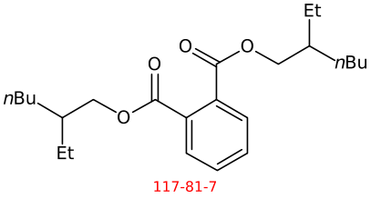

# AOPLink: Extracting and Analyzing Data Related to an AOP of Interest

*This workflow has originally been created in the OpenRiskNet. The original work can be seen [at this link](https://github.com/OpenRiskNet/notebooks/blob/master/AOPLink/Extracting%20and%20analysing%20data%20related%20to%20an%20AOP%20of%20interest.ipynb). Here, we present a reproduction of the workflow in the `R` language. However, please note that this is not an exact replication of the original workflow as some of the tools that are used in the original work are not available anymore, thus, removed or replaced in this reproduction. The R-Markdown file that includes the codes used in this tutorial can be found [here](https://github.com/VHP4Safety/vhp4safety-docs/blob/main/tutorials/aoplink/aoplink.r).*

**Citation:** Marvin Martens, Thomas Exner, Tomaž Mohorič, Chris T Evelo, Egon L Willighagen. Workflow for extracting and analyzing data related to an AOP of interest. 2020

One of the main questions to solve in AOPLink is the finding of data that supports an AOP of interest. To answer that, we have developed this workflow that does that by using a variety of online services:

- AOP-Wiki RDF
- CDK Depict
- AOP-DB RDF
- BridgeDb (*to be added*)
- EdelweissData explorer (*to be added*)
- WikiPathways (*to be added*)

After selecting an AOP of interest, information is extracted from the AOP-Wiki RDF, CDK Depict, and AOP-DB RDF, to get a better understanding of the AOP.

### Loading the Required Packages

A few packages needed to be loaded in order to complete the workflow.


``` r
library(SPARQL)
library(httr)
library(png)
library(magick)
library(flextable)
library(igraph)
# library(networkD3)  # To be used for an interactive AOP plot, if preferred
```

Note that the SPARQL package is available on CRAN only in the archive. So, one needs to download the `.tar.gz` file from the archives (here version 1.16 is used) and install the package from the source file that can be found [here](https://cran.r-project.org/src/contrib/Archive/SPARQL/).


```r
# Installing the SPARQL package from the source file. 
install.packages("path_to_the_file", repos=NULL, type="source")
```


## Defining the AOP of Interest

State the number of the AOP of interest as indicated on AOP-Wiki. Here we use AOP with the id number of [37](https://aopwiki.org/aops/37).


```r
aop_id <- 37
```

### Setting the service URLs

Throughout the workflow, we are going to use several online services such as SPARQL endpoints. Here, these services are defined.


``` r
# SPARQL endpoint URLs
aopwikisparql       <- "https://aopwiki.cloud.vhp4safety.nl/sparql/"
aopdbsparql         <- "http://aopdb.rdf.bigcat-bioinformatics.org/sparql/"
wikipathwayssparql  <- "http://sparql.wikipathways.org/sparql/"

# ChemIdConvert and CDK Depict URLs
chemidconvert <- "https://chemidconvert.cloud.douglasconnect.com/v1/"
cdkdepict     <- "https://cdkdepict.cloud.vhp4safety.nl/"

# BridgeDB base URL
bridgedb <- "http://bridgedb.cloud.vhp4safety.nl/"
```

## AOP-Wiki RDF

#### Service Description

The AOP-Wiki repository is part of the AOP Knowledge Base (AOP-KB), a joint effort of the US-Environmental Protection Agency and European Commission - Joint Research Centre. It is developed to facilitate collaborative AOP development, storage of AOPs, and therefore allow reusing toxicological knowledge for risk assessors. This Case Study has converted the AOP-Wiki XML data into an RDF schema, which has been exposed in a public SPARQL endpoint as a service by VHP4Safety.

#### Implementation
First, general information of the AOP is fetched using a variety of SPARQL queries, using predicates from the [AOP-Wiki RDF schema](https://figshare.com/articles/poster/Enhancing_the_AOP-Wiki_usability_and_accessibility_with_semantic_web_technologies/11323685/1). This is used for:

* Creating an overview table of the AOP of interest
* Extending the AOP network with connected AOPs

Second, stressor chemicals are retrieved and stored for further analysis and fetching of data.

#### Creating the overview table


```r
# Defining all variables as ontology terms present in AOP-Wiki RDF.
title                       <- "dc:title"
webpage                     <- "foaf:page"
creator                     <- "dc:creator"
abstract                    <- "dcterms:abstract"
key_event                   <- "aopo:has_key_event"
molecular_initiating_event  <- "aopo:has_molecular_initiating_event"
adverse_outcome             <- "aopo:has_adverse_outcome"
key_event_relationship      <- "aopo:has_key_event_relationship"
stressor                    <- "ncit:C54571"

# Creating the list of all terms of interest.
list_of_terms <- c(title, webpage, creator, abstract, key_event, 
                   molecular_initiating_event, adverse_outcome, key_event_relationship,
                   stressor)

# Creating a data frame to store the query results. 
aop_info <- data.frame("term"=list_of_terms, "properties"=NA)

# Making the queries for each terms in the selected AOP.
for (i in 1:length(list_of_terms)) {
  term  <- list_of_terms[i] 
  query <- paste0('PREFIX ncit: <http://ncicb.nci.nih.gov/xml/owl/EVS/Thesaurus.owl#>
                  SELECT (group_concat(distinct ?item;separator=";") as ?items)
                  WHERE{
                  ?AOP_URI a aopo:AdverseOutcomePathway;', term, ' ?item.
                  FILTER (?AOP_URI = aop:', aop_id, ')}'
)
  res <- SPARQL(aopwikisparql, query)
  aop_info[i, "properties"] <- res$results$items
}

flextable(aop_info)
```

<div class="tabwid"><style>.cl-b66e763a{}.cl-b667d7a8{font-family:'DejaVu Sans';font-size:11pt;font-weight:normal;font-style:normal;text-decoration:none;color:rgba(0, 0, 0, 1.00);background-color:transparent;}.cl-b66ae484{margin:0;text-align:left;border-bottom: 0 solid rgba(0, 0, 0, 1.00);border-top: 0 solid rgba(0, 0, 0, 1.00);border-left: 0 solid rgba(0, 0, 0, 1.00);border-right: 0 solid rgba(0, 0, 0, 1.00);padding-bottom:5pt;padding-top:5pt;padding-left:5pt;padding-right:5pt;line-height: 1;background-color:transparent;}.cl-b66af9ba{width:0.75in;background-color:transparent;vertical-align: middle;border-bottom: 1.5pt solid rgba(102, 102, 102, 1.00);border-top: 1.5pt solid rgba(102, 102, 102, 1.00);border-left: 0 solid rgba(0, 0, 0, 1.00);border-right: 0 solid rgba(0, 0, 0, 1.00);margin-bottom:0;margin-top:0;margin-left:0;margin-right:0;}.cl-b66af9c4{width:0.75in;background-color:transparent;vertical-align: middle;border-bottom: 0 solid rgba(0, 0, 0, 1.00);border-top: 0 solid rgba(0, 0, 0, 1.00);border-left: 0 solid rgba(0, 0, 0, 1.00);border-right: 0 solid rgba(0, 0, 0, 1.00);margin-bottom:0;margin-top:0;margin-left:0;margin-right:0;}.cl-b66af9ce{width:0.75in;background-color:transparent;vertical-align: middle;border-bottom: 1.5pt solid rgba(102, 102, 102, 1.00);border-top: 0 solid rgba(0, 0, 0, 1.00);border-left: 0 solid rgba(0, 0, 0, 1.00);border-right: 0 solid rgba(0, 0, 0, 1.00);margin-bottom:0;margin-top:0;margin-left:0;margin-right:0;}.tabwid {
  font-size: initial;
  padding-bottom: 1em;
}

.tabwid table{
  border-spacing:0px !important;
  border-collapse:collapse;
  line-height:1;
  margin-left:auto;
  margin-right:auto;
  border-width: 0;
  border-color: transparent;
  caption-side: top;
}
.tabwid-caption-bottom table{
  caption-side: bottom;
}
.tabwid_left table{
  margin-left:0;
}
.tabwid_right table{
  margin-right:0;
}
.tabwid td, .tabwid th {
    padding: 0;
}
.tabwid a {
  text-decoration: none;
}
.tabwid thead {
    background-color: transparent;
}
.tabwid tfoot {
    background-color: transparent;
}
.tabwid table tr {
background-color: transparent;
}
.katex-display {
    margin: 0 0 !important;
}</style><table data-quarto-disable-processing='true' class='cl-b66e763a'><thead><tr style="overflow-wrap:break-word;"><th class="cl-b66af9ba"><p class="cl-b66ae484"><span class="cl-b667d7a8">term</span></p></th><th class="cl-b66af9ba"><p class="cl-b66ae484"><span class="cl-b667d7a8">properties</span></p></th></tr></thead><tbody><tr style="overflow-wrap:break-word;"><td class="cl-b66af9c4"><p class="cl-b66ae484"><span class="cl-b667d7a8">dc:title</span></p></td><td class="cl-b66af9c4"><p class="cl-b66ae484"><span class="cl-b667d7a8">PPARα activation leading to hepatocellular adenomas and carcinomas in rodents</span></p></td></tr><tr style="overflow-wrap:break-word;"><td class="cl-b66af9c4"><p class="cl-b66ae484"><span class="cl-b667d7a8">foaf:page</span></p></td><td class="cl-b66af9c4"><p class="cl-b66ae484"><span class="cl-b667d7a8">https://identifiers.org/aop/37</span></p></td></tr><tr style="overflow-wrap:break-word;"><td class="cl-b66af9c4"><p class="cl-b66ae484"><span class="cl-b667d7a8">dc:creator</span></p></td><td class="cl-b66af9c4"><p class="cl-b66ae484"><span class="cl-b667d7a8">J. Christopher Corton, Cancer AOP Workgroup. National Health and Environmental Effects Research Laboratory, Office of Research and Development, Integrated Systems Toxicology Division, US Environmental Protection Agency, Research Triangle Park, NC. Corresponding author for wiki entry (corton.chris@epa.gov)</span><br></p></td></tr><tr style="overflow-wrap:break-word;"><td class="cl-b66af9c4"><p class="cl-b66ae484"><span class="cl-b667d7a8">dcterms:abstract</span></p></td><td class="cl-b66af9c4"><p class="cl-b66ae484"><span class="cl-b667d7a8">Several therapeutic agents and industrial chemicals induce liver tumors in rats and mice through the activation of the peroxisome proliferator-activated receptor alpha (PPAR&amp;alpha;). The molecular and cellular events by which PPAR&amp;alpha; activators induce rodent hepatocarcinogenesis have been extensively studied and elucidated. The weight of evidence relevant to the hypothesized AOP for PPAR&amp;alpha; activator-induced rodent hepatocarcinogenesis is summarized here. Chemical-specific and mechanistic data support concordance of temporal and dose&amp;ndash;response relationships for the key events associated with many PPAR&amp;alpha; activators including a phthalate ester plasticizer di(2-ethylhexyl)phthalate (DEHP) and the drug gemfibrozil. The key events (KE) identified include the MIE &amp;ndash; PPAR&amp;alpha; activation measured as a characteristic change in gene expression,&amp;nbsp;&amp;nbsp;KE2&amp;nbsp;&amp;ndash; increased enzyme activation, characteristically those involved in lipid metabolism and cell cycle control, KE3&amp;nbsp;&amp;ndash; increased cell proliferation, KE4 &amp;ndash; selective clonal expansion of preneoplastic foci, and the AO &amp;ndash; &amp;nbsp;&amp;ndash; increases in hepatocellular adenomas and carcinomas. &amp;nbsp;Other biological&amp;nbsp;factors modulate the effects of PPAR&amp;alpha; activators.These modulating events include increases in oxidative stress, activation of NF-kB, and inhibition of gap junction intercellular communication. The occurrence of hepatocellular adenomas and carcinomas is specific to mice and rats. The occurrence of the various KEs in&amp;nbsp;hamsters, guinea pigs,&amp;nbsp;cynomolgous monkeys are generally absent.</span><br></p></td></tr><tr style="overflow-wrap:break-word;"><td class="cl-b66af9c4"><p class="cl-b66ae484"><span class="cl-b667d7a8">aopo:has_key_event</span></p></td><td class="cl-b66af9c4"><p class="cl-b66ae484"><span class="cl-b667d7a8">https://identifiers.org/aop.events/1170;https://identifiers.org/aop.events/1171;https://identifiers.org/aop.events/227;https://identifiers.org/aop.events/716;https://identifiers.org/aop.events/719</span></p></td></tr><tr style="overflow-wrap:break-word;"><td class="cl-b66af9c4"><p class="cl-b66ae484"><span class="cl-b667d7a8">aopo:has_molecular_initiating_event</span></p></td><td class="cl-b66af9c4"><p class="cl-b66ae484"><span class="cl-b667d7a8">https://identifiers.org/aop.events/227</span></p></td></tr><tr style="overflow-wrap:break-word;"><td class="cl-b66af9c4"><p class="cl-b66ae484"><span class="cl-b667d7a8">aopo:has_adverse_outcome</span></p></td><td class="cl-b66af9c4"><p class="cl-b66ae484"><span class="cl-b667d7a8">https://identifiers.org/aop.events/719</span></p></td></tr><tr style="overflow-wrap:break-word;"><td class="cl-b66af9c4"><p class="cl-b66ae484"><span class="cl-b667d7a8">aopo:has_key_event_relationship</span></p></td><td class="cl-b66af9c4"><p class="cl-b66ae484"><span class="cl-b667d7a8">https://identifiers.org/aop.relationships/1229;https://identifiers.org/aop.relationships/1230;https://identifiers.org/aop.relationships/1232;https://identifiers.org/aop.relationships/1239;https://identifiers.org/aop.relationships/2252;https://identifiers.org/aop.relationships/2253;https://identifiers.org/aop.relationships/2254</span></p></td></tr><tr style="overflow-wrap:break-word;"><td class="cl-b66af9ce"><p class="cl-b66ae484"><span class="cl-b667d7a8">ncit:C54571</span></p></td><td class="cl-b66af9ce"><p class="cl-b66ae484"><span class="cl-b667d7a8">https://identifiers.org/aop.stressor/11;https://identifiers.org/aop.stressor/175;https://identifiers.org/aop.stressor/191;https://identifiers.org/aop.stressor/205;https://identifiers.org/aop.stressor/206;https://identifiers.org/aop.stressor/207;https://identifiers.org/aop.stressor/208;https://identifiers.org/aop.stressor/210;https://identifiers.org/aop.stressor/211</span></p></td></tr></tbody></table></div>

### Generating AOP Network


```r
key_events <- aop_info[aop_info$term == "aopo:has_key_event", "properties"]
key_events <- unlist(strsplit(key_events, ";"))

mies      <- c()
kes       <- c()
aos       <- c()
kers      <- c()
ke_title  <- list()
# ke_rel    <- list()

for(i in 1:length(key_events)) {
  key_event <- key_events[i]
  
  query <- paste0('SELECT ?MIE_ID ?KE_ID ?AO_ID ?KER_ID ?KE_Title
    WHERE{
    ?KE_URI a aopo:KeyEvent; dcterms:isPartOf ?AOP_URI.
    ?AOP_URI aopo:has_key_event ?KE_URI2; aopo:has_molecular_initiating_event ?MIE_URI; aopo:has_adverse_outcome ?AO_URI; aopo:has_key_event_relationship ?KER_URI.
    ?KE_URI2 rdfs:label ?KE_ID; dc:title ?KE_Title. 
    ?MIE_URI rdfs:label ?MIE_ID.
    ?AO_URI rdfs:label ?AO_ID.
    ?KER_URI rdfs:label ?KER_ID.    
    FILTER (?KE_URI = <', key_event, '>)}
    ') 
  
  res <- SPARQL(aopwikisparql, query)
  res <- res$results
  
  mies  <- append(mies, unique(res$MIE_ID))
  kes   <- append(kes, unique(res$KE_ID))
  aos   <- append(aos, unique(res$AO_ID))
  kers  <- append(kers, unique(res$KER_ID))
  
  ke_title[[i]] <- tapply(res$KE_Title, res$KE_ID, function(x) x[1])
}

mies  <- unique(mies)
kes   <- unique(kes)
aos   <- unique(aos)
kers  <- unique(kers)

# ke_title <- unique(unlist(ke_title))
ke_title <- data.frame("key_event" = names(unlist(ke_title)), 
                  "title" = unlist(ke_title))
ke_title <- ke_title[!duplicated(ke_title), ]
ke_title
```

```
##    key_event                                                           title
## 1    KE 1170                            Increase, Phenotypic enzyme activity
## 2    KE 1171              Increase, Clonal Expansion of Altered Hepatic Foci
## 3     KE 227                                               Activation, PPARα
## 4     KE 716                      Increase, cell proliferation (hepatocytes)
## 5     KE 719                Increase, hepatocellular adenomas and carcinomas
## 14    KE 266         Decrease, Steroidogenic acute regulatory protein (STAR)
## 15    KE 289                           Decrease, Translocator protein (TSPO)
## 16    KE 348                           Malformation, Male reproductive tract
## 17    KE 406                                             impaired, Fertility
## 18    KE 413               Reduction, Testosterone synthesis in Leydig cells
## 19    KE 414                             Increase, Luteinizing hormone (LH) 
## 20    KE 415                                        Hyperplasia, Leydig cell
## 21    KE 416                            Increase proliferation, Leydig cell 
## 22    KE 446                                   Reduction, testosterone level
## 23    KE 447                Reduction, Cholesterol transport in mitochondria
## 24    KE 451             Inhibition, Mitochondrial fatty acid beta-oxidation
## 25    KE 458                                 Increased, De Novo FA synthesis
## 26    KE 459                                      Increased, Liver Steatosis
## 27    KE 478                                                Activation, NRF2
## 28    KE 479                                               Activation, NR1H4
## 29    KE 480                                                 Activation, SHP
## 30    KE 482                                         Decreased, DHB4/HSD17B4
## 31    KE 483                                           Activation, LXR alpha
## 34    KE 878                                             Inhibition, SREBP1c
## 35    KE 879                                                Activation, MTTP
## 36    KE 880                                              Increased, ApoB100
## 37    KE 881                                         Increased, Triglyceride
## 40   KE 1214 Altered gene expression specific to CAR activation, Hepatocytes
## 42    KE 715                    Activation, Constitutive androstane receptor
## 45    KE 774                      Increase, Preneoplastic foci (hepatocytes)
## 46    KE 785                                   Activation, Androgen receptor
## 50    KE 209                                               Peptide Oxidation
## 55    KE 724          Inhibition, Pyruvate dehydrogenase kinase (PDK) enzyme
## 56    KE 726            Increased, Induction of pyruvate dehydrogenase (PDH)
## 57    KE 768                                          Increase, Cytotoxicity
## 58    KE 769                                  Increase, Oxidative metabolism
## 61    KE 786                            Increase, Cytotoxicity (hepatocytes)
## 62    KE 787         Increase, Regenerative cell proliferation (hepatocytes)
```

```r
# Listing all intermediate KEs that are not MIEs or AOs. 
kes_intermediate <- kes[!(kes %in% mies) & !(kes %in% aos)]
```


``` r
# Creating the AOP plot
pathway <- list()
for (i in 1:length(kers)) {
  ker   <- kers[i]
  query <- paste0('SELECT ?KE_UP_ID ?KE_DOWN_ID 
                WHERE{
                ?KER_URI a aopo:KeyEventRelationship; rdfs:label ?KER_ID; aopo:has_upstream_key_event ?KE_UP_URI; aopo:has_downstream_key_event ?KE_DOWN_URI.
                ?KE_UP_URI rdfs:label ?KE_UP_ID.
                ?KE_DOWN_URI rdfs:label ?KE_DOWN_ID.
                FILTER (?KER_ID = "', ker, '")}')
  # tmp <- SPARQL(aopwikisparql, query)
  # pathway[[i]] <- tmp$results
  pathway[[i]] <- SPARQL(aopwikisparql, query)$results
  names(pathway)[i] <- ker
}

pathway_plot <- make_graph(edges=unlist(pathway))

pathway_color <- rep(NA, length(names(V(pathway_plot))))
pathway_color[names(V(pathway_plot)) %in% mies]              <- "green"
pathway_color[names(V(pathway_plot)) %in% kes_intermediate]  <- "yellow"
pathway_color[names(V(pathway_plot)) %in% aos]               <- "red"
V(pathway_plot)$color <- pathway_color
par(mar = c(0, 0, 0, 0))
plot(pathway_plot)
```


``` r
# A very basic interactive graph can be created in RStudio with:
# networkD3::simpleNetwork(as.data.frame(matrix(unlist(pathway), byrow=TRUE,
#                         ncol=2)), opacity=1, linkColour="orange",
#                         nodeColour="green", fontSize=12)
```

### Query All Chemicals that are Part of the Selected AOP


```r
query <- paste0('PREFIX ncit: <http://ncicb.nci.nih.gov/xml/owl/EVS/Thesaurus.owl#>
                SELECT ?CAS_ID (fn:substring(?CompTox,33) as ?CompTox_ID) ?Chemical_name
                WHERE{
                ?AOP_URI a aopo:AdverseOutcomePathway; ncit:C54571 ?Stressor.
                ?Stressor aopo:has_chemical_entity ?Chemical.
                ?Chemical cheminf:000446 ?CAS_ID; dc:title ?Chemical_name.
                OPTIONAL {?Chemical cheminf:000568 ?CompTox.}
                FILTER (?AOP_URI = aop:', aop_id, ')}
                ')

res <- SPARQL(aopwikisparql, query)
res <- res$results[, c("Chemical_name", "CAS_ID", "CompTox_ID")]

# List of compounds.
res
```

```
##                Chemical_name     CAS_ID    CompTox_ID
## 1 Di(2-ethylhexyl) phthalate   117-81-7 DTXSID5020607
## 2                Gemfibrozil 25812-30-0 DTXSID0020652
## 3                  Nafenopin  3771-19-5 DTXSID8020911
## 4                Bezafibrate 41859-67-0 DTXSID3029869
## 5                Fenofibrate 49562-28-9 DTXSID2029874
## 6             Pirinixic acid 50892-23-4 DTXSID4020290
## 7               Ciprofibrate 52214-84-3 DTXSID8020331
## 8                 Clofibrate   637-07-0 DTXSID3020336
```

```r
# CAS-IDs of the compounds
res$CAS_ID
```

```
## [1] "117-81-7"   "25812-30-0" "3771-19-5"  "41859-67-0" "49562-28-9" "50892-23-4"
## [7] "52214-84-3" "637-07-0"
```


## ChemIdConvert and CDK Depict

### Service description

The ChemIdConverter allows users to submit and translate a variety of chemical descriptors, such as SMILES and InChI, through a REST API, whereas CDK Depcit is a webservice that converts a SMILES into 2D depictions (SVG or PNG).

### Implementation

Convert selected chemical names and display their chemical structures in a dataframe. It takes CAS IDs as an input, and translates them into Smiles and InChI Keys.


``` r
compoundstable <- data.frame(CAS_ID=res$CAS_ID, Smiles=NA, InChiKey=NA)

for(i in 1:nrow(compoundstable)) {
  compoundstable$Smiles[i]    <- content(GET(paste0(chemidconvert,
          "cas/to/smiles?cas=", compoundstable$CAS_ID[i])))$smiles
  compoundstable$InChiKey[i]  <- content(GET(paste0(chemidconvert,
          "cas/to/inchikey?cas=", compoundstable$CAS_ID[i])))$inchikey
}
compoundstable
```

```
##       CAS_ID                                         Smiles
## 1   117-81-7       CCCCC(CC)COC(=O)c1ccccc1C(=O)OCC(CC)CCCC
## 2 25812-30-0                Cc1ccc(C)c(OCCCC(C)(C)C(O)=O)c1
## 3  3771-19-5         CC(C)(Oc1ccc(cc1)C2CCCc3ccccc23)C(O)=O
## 4 41859-67-0   CC(C)(Oc1ccc(CCNC(=O)c2ccc(Cl)cc2)cc1)C(O)=O
## 5 49562-28-9 CC(C)OC(=O)C(C)(C)Oc1ccc(cc1)C(=O)c2ccc(Cl)cc2
## 6 50892-23-4            Cc1cccc(Nc2cc(Cl)nc(SCC(O)=O)n2)c1C
## 7 52214-84-3            CC(C)(Oc1ccc(cc1)C2CC2(Cl)Cl)C(O)=O
## 8   637-07-0                   CCOC(=O)C(C)(C)Oc1ccc(Cl)cc1
##                      InChiKey
## 1 BJQHLKABXJIVAM-UHFFFAOYSA-N
## 2 HEMJJKBWTPKOJG-UHFFFAOYSA-N
## 3 XJGBDJOMWKAZJS-UHFFFAOYSA-N
## 4 IIBYAHWJQTYFKB-UHFFFAOYSA-N
## 5 YMTINGFKWWXKFG-UHFFFAOYSA-N
## 6 SZRPDCCEHVWOJX-UHFFFAOYSA-N
## 7 KPSRODZRAIWAKH-UHFFFAOYSA-N
## 8 KNHUKKLJHYUCFP-UHFFFAOYSA-N
```


``` r
# Please note that this code chunk will download compound images to your 
# working directory. 
for(i in 1:nrow(compoundstable)) {
  tmp <- GET(paste0(cdkdepict, "depict/bot/png?smi=",
                    URLencode(compoundstable$Smiles[i]), "%20",
                    compoundstable$CAS_ID[i],
                    "&showtitle=true&abbr=on&zoom=1.5"))
  writePNG(content(tmp), target=paste0(compoundstable$CAS_ID[i], "_test.png"))
}

# par(mfrow=c(4, 2))
for(i in 1:nrow(compoundstable)){
  img <- image_read(paste0(compoundstable$CAS_ID[i], "_test.png"))
  plot(img)
}
```



