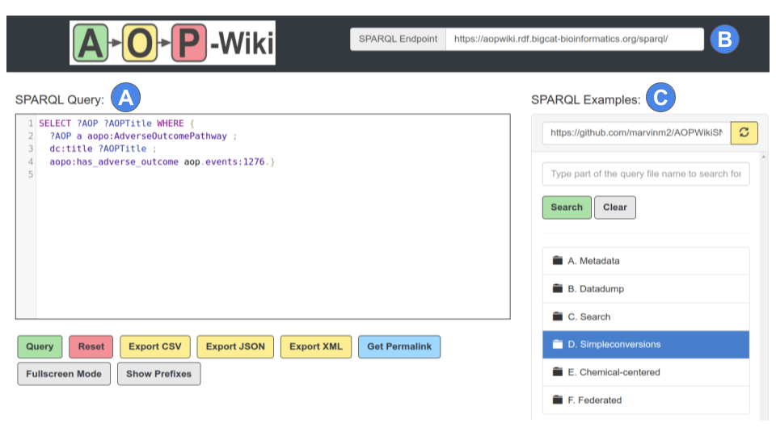
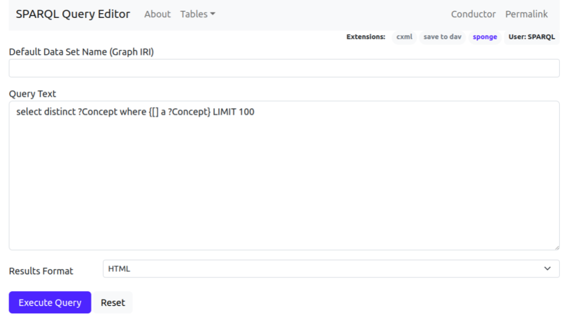
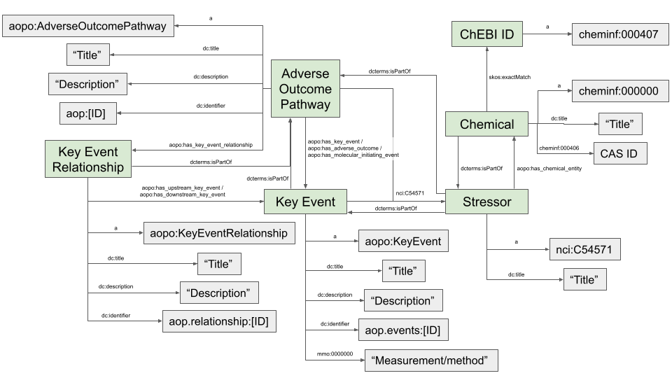

# AOP-Wiki service tutorial
---
The AOP-Wiki service on the VHP4Safety platform consists of the AOP-Wiki SPARQL endpoint and AOP-Wiki SNORQL User Interface (UI). The data is loaded in Resource Description Framework (RDF) format, and this service allows the use of SPARQL queries to extract the data in a flexible and reproducible manner. The service can be used through direct interaction in the browser, or from coding environments. This service description will introduce both the user interaction and the access through coding (automation with *i.e.* R or Python). Also, the general framework of the AOP-Wiki RDF will be described.

---
## AOP-Wiki SNORQL for direct user access
*accessible through [URL here]*
The AOP-Wiki SNORQL UI (*Fig. 1*) has a handful of user-directed functionalities. Besides the central panel for SPARQL queries with syntax highlighting, the SNORQL UI provides an example query panel that is dynamically configured based on a GitHub repository (_e.g._ [github.com/marvinm2/AOPWikiSNORQL](https://github.com/marvinm2/AOPWikiSNORQL)). This allows for pre-loading of SPARQL queries based on particular use cases, and topics, and organizes these queries in a folder structure. The interface also has an input field for the SPARQL endpoint that should be queried by the SNORQL UI, in case the user wants to execute SPARQL queries on a different SPARQL endpoint (instance). Finally, a handful of functionalities are included below the SPARQL query panel: various options to export results, a full-screen mode for writing SPARQL queries, and a permalink creator for convenient sharing of SPARQL queries.

_Figure 1: AOP-Wiki SNORQL interface. 1: the SPARQL query frame. 2: the SPARQL endpoint field. 3: the example query panel._

_Figure 2: AOP-Wiki SPARQL query panel. Illustration of the structure in a GitHub repository to dynamically load SPARQL queries in the example panel._

---
## AOP-Wiki SPARQL endpoint for automated access
*accessible through [URL here]*
For automated access through R, Python, bash, and other coding environments, one can utilize the SPARQL endpoint, as the main access point to execute SPARQL queries against the AOP-Wiki RDF. This is also the service that is used by the SNORQL UI for the execution of SPARQL queries.

_Figure 3: AOP-Wiki SPARQL endpoint, with a SPARQL query panel and options to export results._

## AOP-Wiki RDF schema
The AOP-Wiki SPARQL endpoint has the AOP-Wiki RDF loaded and ready to query. To be able to construct advanced SPARQL queries, it is useful to understand the RDF schema, which has been published in [this paper](https://doi.org/10.1089/aivt.2021.0010). 

_Figure 4: Simplified depiction of the AOP-Wiki RDF schema._
