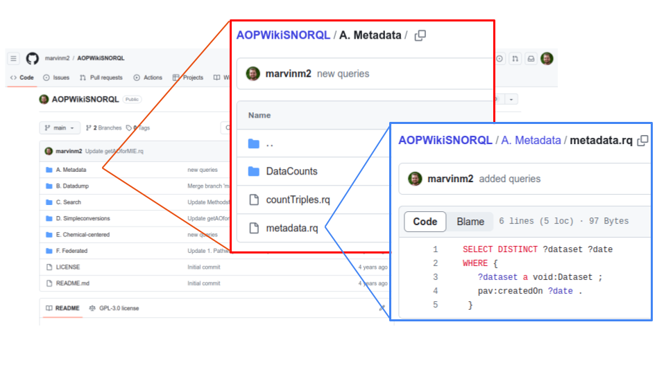

# AOP-Wiki Service Tutorial

The AOP-Wiki service on the VHP4Safety platform consists of the AOP-Wiki SPARQL endpoint and the AOP-Wiki SNORQL User Interface (UI). The data is loaded in Resource Description Framework (RDF) format, enabling the use of SPARQL queries to extract the data in a flexible and reproducible manner. The service can be accessed either directly through a web browser or programmatically from coding environments. This tutorial will introduce both user interaction through the web UI and automated access via coding environments such as R or Python. Additionally, an overview of the AOP-Wiki RDF framework will be provided.

## AOP-Wiki SNORQL for Direct User Access
*Accessible through [aopwiki.cloud.vhp4safety.nl](aopwiki.cloud.vhp4safety.nl)*

The AOP-Wiki SNORQL UI (Figure 1) offers several user-friendly features. It includes a central panel for SPARQL queries with syntax highlighting and an example query panel that is dynamically configured based on a GitHub repository (e.g., [github.com/marvinm2/AOPWikiSNORQL](github.com/marvinm2/AOPWikiSNORQL)). This allows for the pre-loading of SPARQL queries tailored to specific use cases and topics, organized in a folder structure. The interface also features an input field for specifying the SPARQL endpoint to be queried, enabling users to execute SPARQL queries on different endpoints if desired. Additional functionalities include options to export results, a full-screen mode for writing queries, and a permalink creator for easy sharing of SPARQL queries.


_Figure 1: AOP-Wiki SNORQL interface. A: SPARQL query frame. B: SPARQL endpoint field. C: Example query panel._



_Figure 2: Example structure of a GitHub repository used to dynamically load SPARQL queries into the example query panel._

## AOP-Wiki SPARQL Endpoint for Automated Access
*Accessible through [aopwiki.cloud.vhp4safety.nl/sparql/](aopwiki.cloud.vhp4safety.nl/sparql/)*

For automated access via environments such as R, Python, or bash, the SPARQL endpoint serves as the primary access point to execute SPARQL queries against the AOP-Wiki RDF. This is the same service utilized by the SNORQL UI for query execution.


_Figure 3: AOP-Wiki SPARQL endpoint with a SPARQL query panel and export options._

The AOP-Wiki SPARQL endpoint can be accessed from various coding environments using relevant packages or libraries. Below are sample codes for executing a simple SPARQL query against the endpoint:

### Python Sample Code
```python
Code kopiëren
# Install the required library
# pip install SPARQLWrapper

from SPARQLWrapper import SPARQLWrapper, JSON

# Define the endpoint and the query
endpoint_url = "https://aopwiki.cloud.vhp4safety.nl/sparql/"
query = """
SELECT ?AOP ?AOPName
WHERE {
 ?AOP a aopo:AdverseOutcomePathway ;
 dc:title ?AOPName . 
}
"""

# Initialize the SPARQL wrapper
sparql = SPARQLWrapper(endpoint_url)
sparql.setQuery(query)
sparql.setReturnFormat(JSON)

# Execute the query and fetch results
results = sparql.query().convert()

# Process and print the results
for result in results["results"]["bindings"]:
    print(f"AOP: {result['AOP']['value']}, AOPName: {result['AOPName']['value']}")
```

### R Sample Code
```r
Code kopiëren
# Install the required package
# install.packages("SPARQL")

library(SPARQL)

# Define the endpoint and the query
endpoint <- "https://aopwiki.cloud.vhp4safety.nl/sparql/"
query <- "
SELECT ?AOP ?AOPName
WHERE {
 ?AOP a aopo:AdverseOutcomePathway ;
 dc:title ?AOPName . 
}
"

# Execute the query and fetch results
results <- SPARQL(endpoint, query)$results

# Print the results
print(results)
```

## AOP-Wiki RDF Schema
The AOP-Wiki SPARQL endpoint has the AOP-Wiki RDF data loaded and ready for querying. To construct advanced SPARQL queries, it is beneficial to understand the RDF schema, which has been detailed in this paper.


_Figure 4: Simplified depiction of the AOP-Wiki RDF schema._
