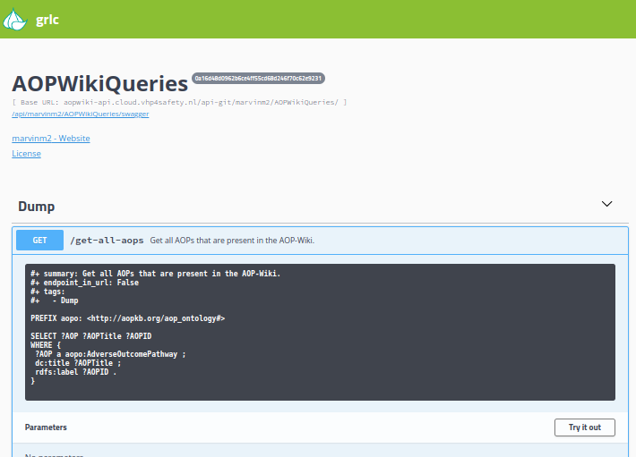
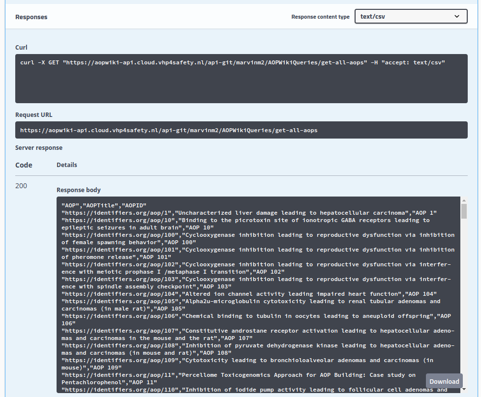

# AOP-Wiki API Tutorial
---
**Author:** Marvin Martens

The AOP-Wiki (RESTful) API provides a programmatic way to access data from in AOP-Wiki, a repository that documents and stores Adverse Outcome Pathways (AOPs), which are structured ways to represent biological events leading to adverse health effects. The API is RESTful, meaning it is based on standard HTTP methods like GET and POST, and it outputs data in JSON format.

This tutorial covers how to interact with the AOP-Wiki API using the Swagger interface, CURL commands, and programming languages like Python and R. By the end of this guide, you should be able to retrieve specific data from AOP-Wiki, such as information about key events, molecular initiating events, or entire AOPs.

## The Swagger Interface
*Accessible through [aopwiki-api.cloud.vhp4safety.nl](aopwiki-api.cloud.vhp4safety.nl)*

The AOP-Wiki API comes with a Swagger interface that allows the exploration and testing of API endpoints in the web browser. This is a great starting point for understanding the available API methods and parameters. By clicking a method and pressing the **"Try it out"** button, one can execute requests, see the responses, and download if necessary.



When executing the request, multiple responses will appear, including the corresponding CURL command, a request URL, and the response body (csv format by default). 



## Making external API Calls

The AOP-Wiki API also allows CURL commands and HTTP requests to retrieve AOP-Wiki data. CURL is a command-line tool that allows you to transfer data using various protocols, including HTTP, and request commands can be executed from coding environments such as Python and R. Below are examples for the most basic API call to retrieve all AOPs with their title and ID using CURL, Python and R.

### Using CURL:
```bash
curl -X GET "https://aopwiki-api.cloud.vhp4safety.nl/api-git/marvinm2/AOPWikiQueries/get-all-aops" -H "accept: text/csv"
```

### Using the API in Python
Python's **requests** library makes it simple to interact with REST APIs. Below is an example of how to use Python to make a GET request to the AOP-Wiki API.

```python
import requests

url = "https://aopwiki-api.cloud.vhp4safety.nl/api-git/marvinm2/AOPWikiQueries/get-all-aops"
response = requests.get(url)

if response.status_code == 200:
    data = response.json()
    print(data)
else:
    print(f"Failed to retrieve data: {response.status_code}")
```

### Using the API in R
R users can leverage the **httr** package to interact with the AOP-Wiki API. 
```R
library(httr)

url <- "https://aopwiki-api.cloud.vhp4safety.nl/api-git/marvinm2/AOPWikiQueries/get-all-aops"

response <- GET(url)

if (status_code(response) == 200) {
  data <- content(response, "parsed")
  print(data)
} else {
  print(paste("Failed to retrieve data:", status_code(response)))
}
```

## Conclusion
This tutorial has provided a brief introduction to using the AOP-Wiki API using the Swagger interface, CURL, Python, or R. The AOP-Wiki API offers a flexible and powerful way to access and integrate AOP data into your research or applications. For any suggestions, requests, bugs, or questions, feel free to file an issue at [github.com/marvinm2/AOPWikiQueries/issues](https://github.com/marvinm2/AOPWikiQueries/issues).