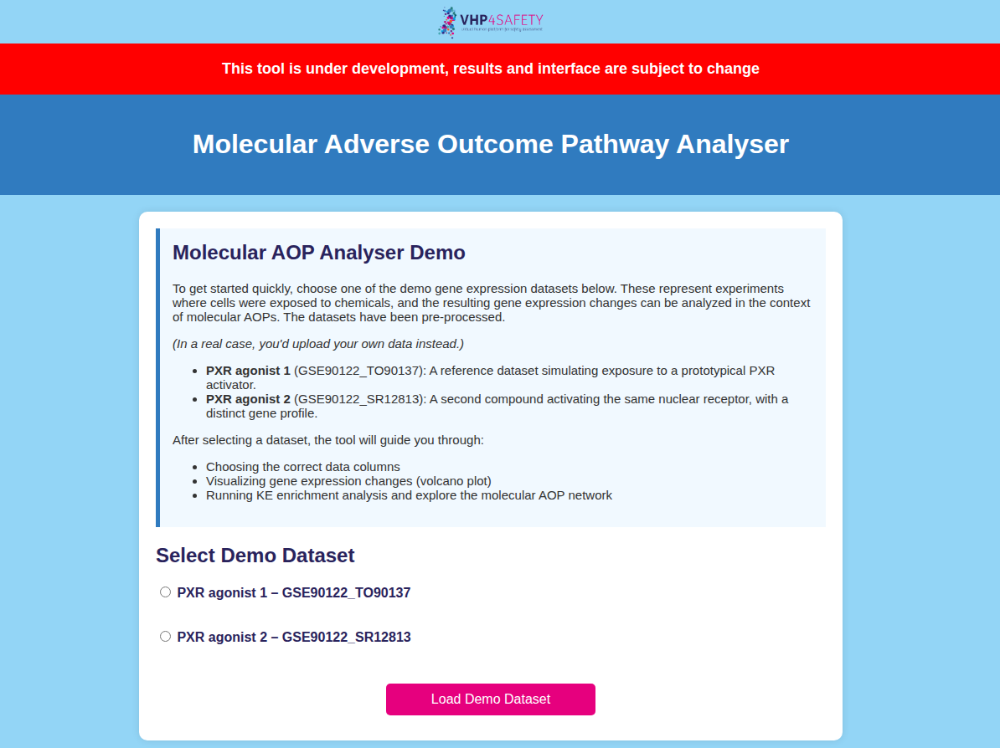
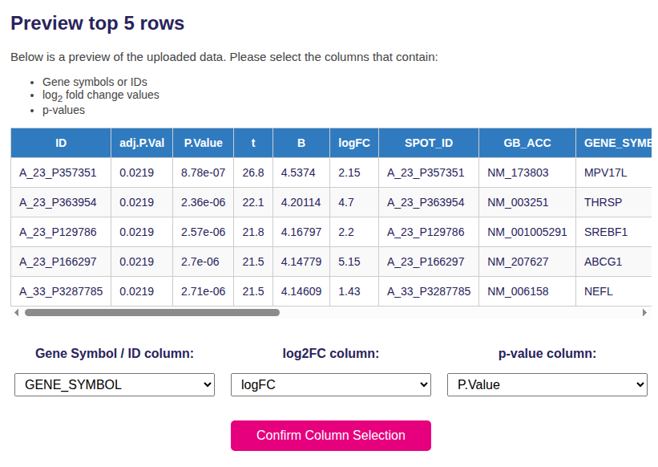
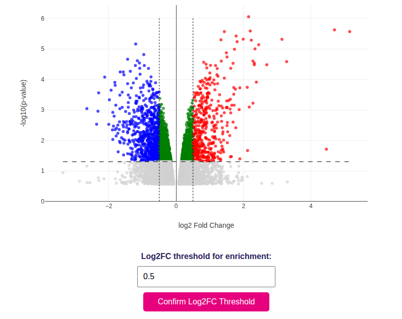
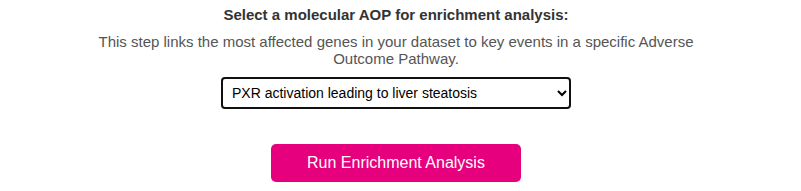
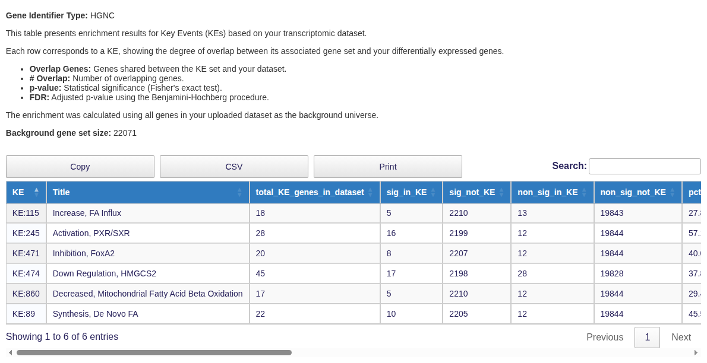
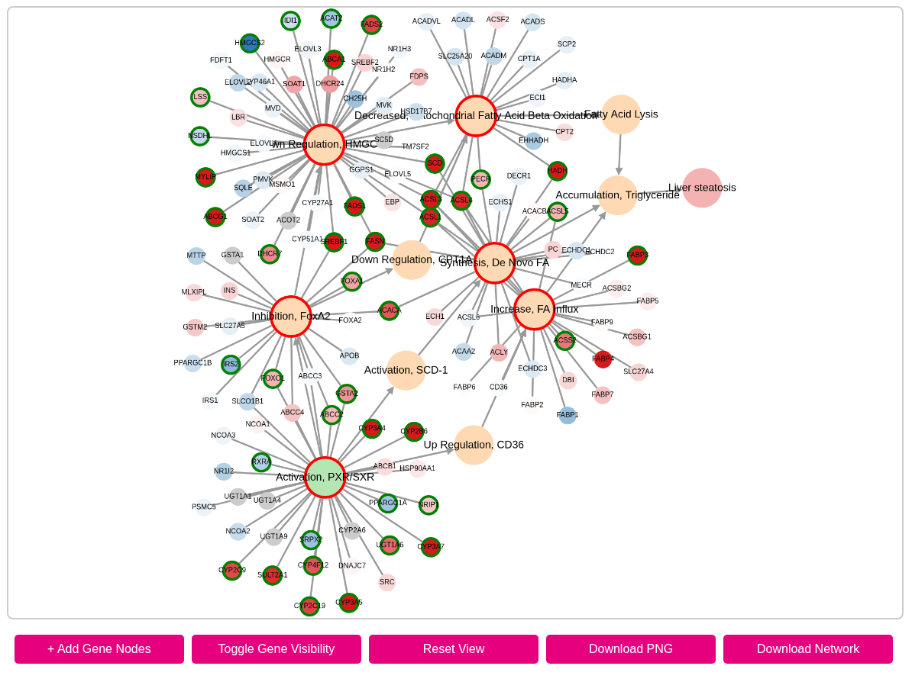

# Molecular Adverse Outcome Pathway analyser tutorial

**Author:** Marvin Martens

The molAOP analyser service on the VHP4Safety platform enables users to analyse transcriptomic data in the context of molecular Adverse Outcome Pathways (AOPs). The tool allows users to upload differential expression data or select from built-in demo datasets. It then guides them through gene selection, visualisation (volcano plots), and Key Event enrichment analysis based on predefined KE-to-pathway mappings.

This tutorial guides you through the complete workflow, using screenshots and examples. No coding is required to use the tool.

## Step 1: Selecting or Uploading a Dataset

The home page provides two options:
- Select from demo datasets simulating chemical exposures
- Upload your own CSV/TSV file containing gene-level differential expression results (currently not live)

Each dataset must contain:

- A column with gene identifiers (symbols, Ensembl, or Entrez)
- A column with log2 fold change values
- A column with p-values

*Figure 1: Choose a built-in dataset.*

## Step 2: Column Selection and Data Preview

Once a dataset is uploaded or selected, the tool previews the first few rows and asks you to assign the relevant columns.

*Figure 2: Assign gene symbol / ID, log2FC, and p-value columns for your dataset.*

This step ensures that downstream visualisation and analysis use the correct inputs.

## Step 3: Volcano Plot Visualisation

The tool generates a volcano plot where each point represents a gene, with axes for:
- X-axis: log2 fold change
- Y-axis: –log10(p-value)

Color coding:
- Red: significantly upregulated genes
- Blue: significantly downregulated genes
- Green: statistically significant, small fold change

You can adjust the log2FC threshold to define the enrichment cutoff.

*Figure 3: Volcano plot showing differentially expressed genes.*

## Step 4: AOP Selection and Enrichment Analysis

After confirming thresholds, select one of the available AOPs from a dropdown menu. Each AOP comes with a curated list of Key Events and their mapped gene sets.

Click “Run Enrichment Analysis” to perform the calculation using Fisher’s exact test.

*Figure 4: Select the AOP that best matches your case study or dataset.*

## Step 5: Enrichment Table

The results are shown in an interactive table where each row is a Key Event.

Columns include:

- \# Overlap: number of shared genes
- p-value and FDR: significance of enrichment
- Odds Ratio (optional): strength of association

You can export results in CSV, Excel, or print format.

*Figure 5: KE enrichment results with significance statistics.*

## Step 6: AOP Network Visualisation

The enriched AOP is rendered as an interactive graph. It includes:

- KE nodes, color-coded by effect size
- Significant KEs with red borders
- Gene nodes (toggleable), colored by log2FC and bordered green if significant

Use the buttons to add gene nodes, toggle their visibility, reset the view, or download the network as PNG/JSON.

*Figure 6: Interactive network showing enriched KEs and their connections.*

## Output Files

All enrichment outputs are generated in-browser, and tables and networks can be exported for offline use. No data is stored permanently unless the user chooses to download it.

## Acknowledgements
This tool is part of the VHP4Safety platform and uses:

- Cytoscape.js for network rendering
- Plotly for interactive visualisation
- Pandas and SciPy for data handling and statistics

For issues or feedback, please visit https://github.com/marvinm2/molAOP-analyser/issues.
