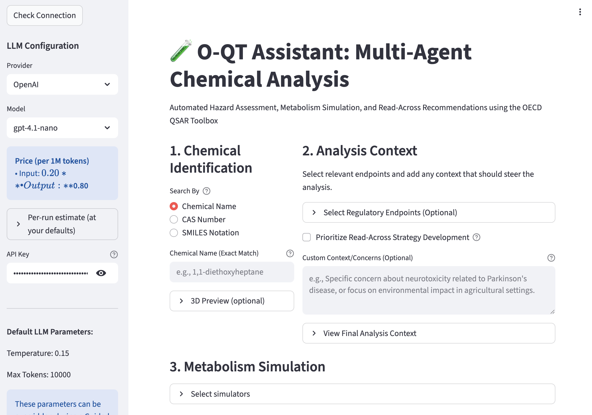
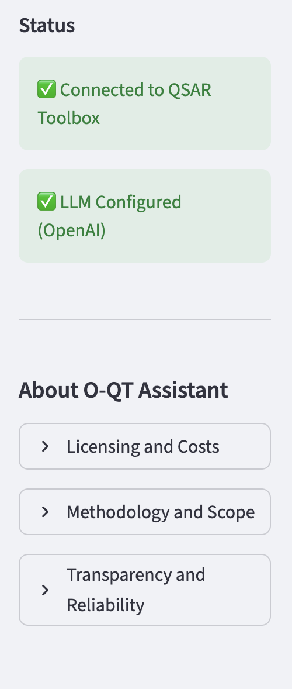

# O-QT Assistant: Multi-Agent Chemical Analysis

**VHP4Safety Team**

The O-QT Assistant application offers users a multi-agent interface to automate chemical hazard assessment, metabolism simulation, and read-across recommendations using the OECD QSAR Toolbox. Unlike standard manual workflows, this tool acts as an intelligent automation layer. It synthesizes data by employing a "Context → Specialists → Read-Across → Synthesis" agent workflow, connecting directly to a locally running instance of the QSAR Toolbox via its Web API.

The assistant is designed to streamline complex regulatory tasks by allowing users to input natural language context or specific endpoints. The system then coordinates specialized AI agents to fetch properties, simulate metabolism, and identify analogues, eventually generating a comprehensive, citation-backed hazard report.

## Configuration and Connection

The application's initial interface requires two key connections to function: a link to the Large Language Model (LLM) provider and a connection to the local QSAR Toolbox (Figure 1).

In the sidebar, users must configure the LLM Provider (e.g., OpenAI) and the specific model (e.g., gpt-4.1-nano). To enable the AI agents, a valid API Key is required which can be generated from their respective providers, e.g., [OpenAI](https://platform.openai.com/api-keys), [OpenRouter](https://openrouter.ai).

Once configured, the status panel provides real-time feedback. A green checkmark indicates a successful handshake with both the LLM provider and the local QSAR Toolbox API.

Figure 2 shows the green checkmarks that confirm the local QSAR Toolbox and the chosen LLM provider are connected. If either checkmark is missing, we recommend you to enter the API key again, verify that the QSAR Toolbox is running, and click “Check Connection”.

## Chemical Identification and Analysis Context

Once connected, the user acts as the manager of the assessment workflow. The interface is divided into three logical steps (see Figure 1):

**Chemical Identification:** Users can define their target substance using a Chemical Name, CAS Number, or SMILES Notation. The system includes a 3D preview to verify the structure.

**Analysis Context:** This section steers the AI agents. Users can select specific regulatory endpoints, prioritize read-across strategy development, or provide custom context (e.g., "focus on neurotoxicity related to Parkinson's disease").

**Metabolism Simulation:** Users can select specific metabolic simulators to generate metabolites, which the agents will then include in the screening process.

**A guided run to conduct your first analysis**
1) Enter the substance under Chemical Identification (use the exact name or CAS for best matches).
2) Add any context or endpoints that matter (e.g., developmental toxicity). If unsure, leave it blank and let the tool propose options.
3) Select simulators if you want metabolites considered; otherwise keep defaults.
4) Click “View Final Analysis Context” to confirm what will be sent.
5) Press “Check Connection” (if needed) and start the run. Watch for green checks in the Status panel.
6) Review the comprehensive output: profiling, structural alerts, analogue data, and the reliability call. Use it as a starting point for regulatory dossiers; follow up with expert judgment when needed.

If you doubt that something is incorrect, such as
- No green checkmarks: re-enter the API key, ensure QSAR Toolbox is running locally, and press “Check Connection.”
- Missing or odd structure: double-check the name/CAS/SMILES; use the 3D preview to confirm the structure.
- Sparse results: broaden context or endpoints, and include metabolites to increase analogue coverage.

## Automated Assessment

After defining the inputs, the user initiates the multi-agent workflow. The system triggers "Specialist" agents to profile the target chemical and its generated metabolites against the Toolbox's databases.

The output is a synthesized report in pdf format that includes a detailed breakdown of the assessment process, including the agents' reasoning and data sources. The "Comprehensive output" bundles profiling results, structural alerts, analogue data points, and a clear explainable, regulation-ready assessment.
