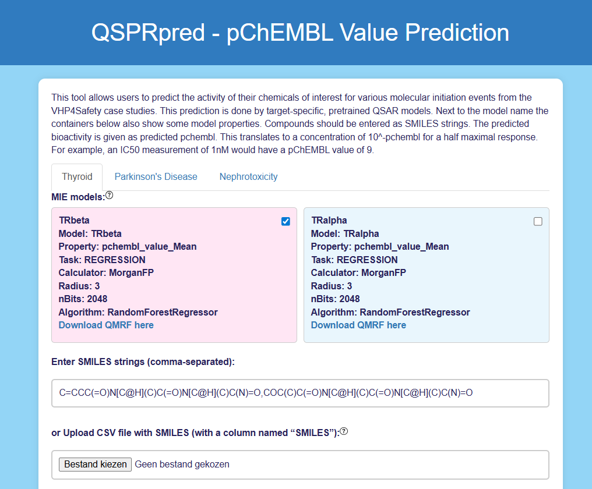

# QSPRpred App: Predicting Molecular Initiating Event Activation based on chemical structure

**Linde Schoenmaker**

## Introduction

The QSPRpred app is designed to perform hazard identification. It does this by predicting the interaction between a chemical of interest and relevant biological targets (called molecular initiating events (MIEs). 

It should be used to perform hazard identification for:

* chemical-induced Parkinson's disease (MIE = metabotropic glutamate receptors)
* thyroid-mediated neurodevelopmental toxicity (MIE = thyroid hormone receptors)

MIE activation is an important part of safety assessment on the VHP4Safety platform. It links the presense of a chemical in the human body to a cascade of (known) responses that ends with an adverse outcome (AO). 

This prediction is done by target-specific, pretrained QSAR models. QSAR models are machine learning models trained to predict properties of chemicals. These models were trained on curated datasets from the Papyrus database <a href="https://link.springer.com/article/10.1186/s13321-022-00672-x" target="_blank">(more information Papyrus)</a>. Model predictions are accurate for chemicals similar to the training set. Highly different molecules do not fall within the domain of applicability (an indication of this will be given by the tool).

## Accessing the Tool

Access the tool here:
- [https://qsprpred.cloud.vhp4safety.nl/](https://qsprpred.cloud.vhp4safety.nl/)
- no prerequisites

## Tool Functionalities

- The app’s initial interface allows users to:
  - select a MIE model  
  - specify the chemical(s) of interest (Figure 1)

- Each model box displays key model characteristics.

- A full model description is provided as a QMRF, including:
  - general information  
  - endpoint (i.e. the biological target of the MIE) 
  - algorithm  
  - domain of applicability  
  - goodness-of-fit  
  - predictivity  
  - interpretation  
  - miscellaneous information

- Molecules can be input in two ways:
  - as comma-separated SMILES strings  
  - via a CSV file containing a **“SMILES”** column
  - <a href="https://www.daylight.com/dayhtml/doc/theory/theory.smiles.html" target="_blank">more information SMILES</a>

*Figure 1: User Interface of the QSPRpred App. The user can select between TRbeta (selected) and TRalpha models and input the desired chemical(s) as SMILES strings.*

## Interpreting the Output

Depending on the model the readout is either a numeric value or an activity class (active/inactive). In both cases the endpoint is based on the pChEMBL value <a href="https://chembl.gitbook.io/chembl-interface-documentation/frequently-asked-questions/chembl-data-questions#what-is-pchembl" target="_blank">(more information pChEMBL)</a>. Briefly, this value is a negative logarithmic measure for activity and translates to a concentration of 10^-pchembl for a half maximal response. For example, an IC50 measurement of 1nM would have a pChEMBL value of 9. More information about each model can be found in the QMRF document.

- After selecting a model, the user can start the prediction by clicking **Run Prediction**.
  - This executes the chosen QSAR model(s) and produces activity predictions.
  - Along with the prediction value, an indication of the **domain of applicability** is always shown.

- Additional details are available under the **Comprehensive output** tab, including:
  - information on the nearest neighbor from the training set  
    - its structure  
    - similarity to the input molecule  
    - measured value  
    - data source(s)

- Each prediction is also accompanied by a **QPRF document**, which includes:
  - information about the input substance  
  - the model used  
  - the prediction  
  - the input  
  - applicability domain  
  - reliability  
  - (all model-available information is pre-filled, though the document is not fully completed)

- The QPRF is intended to support the user by summarizing and documenting key information about QSAR predictions.

For risk assessment, this prediction gives an indication of chemical hazard. When binding surpasses a certain threshold the chemical poses a chemical hazard. Derive a complete safety assessment by combining chemical hazard with internal exposure (derived from toxicokinetic models) and quantitative modelling of the adverse outcome pathway.

## Summary

QSPRpred lets users predict MIE activation for their chemical(s) of interest. This is useful for hazard identification of specific chemicals. Within the VHP workflow, MIE activation is used to link internal concentrations to quantitative adverse outcome pathways (qAOPs). Read our <a href="https://chemrxiv.org/engage/chemrxiv/article-details/6926d27065a54c2d4abc69f9" target="_blank">preprint</a> for more information about the models for chemical-induced Parkinson's disease. Explore the tool further using our <a href="https://lindeschoenmaker.github.io/" target="_blank">practice exercises</a>.

## References

 - <a href="https://tpi.tv/watch/151" target="_blank">Introductory video</a>
 - <a href="https://chemrxiv.org/engage/chemrxiv/article-details/6926d27065a54c2d4abc69f9" target="_blank">Preprint article about the models for chemical-induced Parkinson's disease</a>
  - <a href="https://lindeschoenmaker.github.io/" target="_blank">Practice exercises</a>
